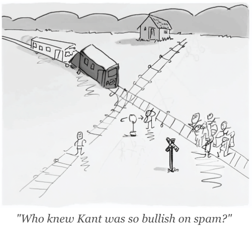

  

    CleanOutbound.com
  

  

    
    By Sergio González
  

I’m fascinated by moral philosophy — the stubborn question of why some things are wrong and others are right. I’m equally absorbed, in my professional life, by the design of commercial systems that help companies sell more. <strong>Clean Outbound</strong> is where these two currents meet.

I don’t know if this is a blog, or something else entirely. For now, it’s a set of reflections, curious to see where they lead.

