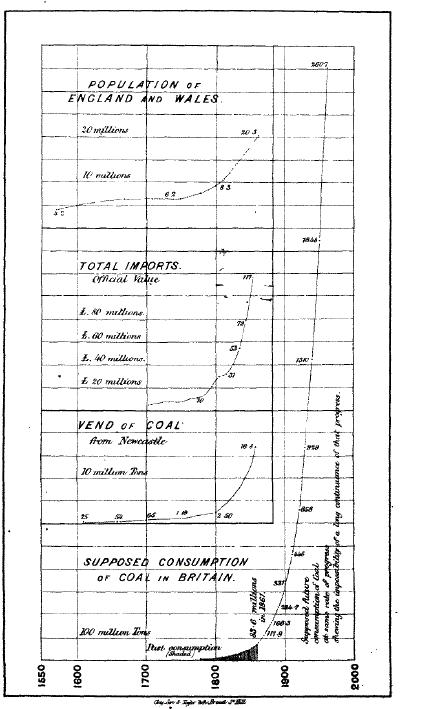
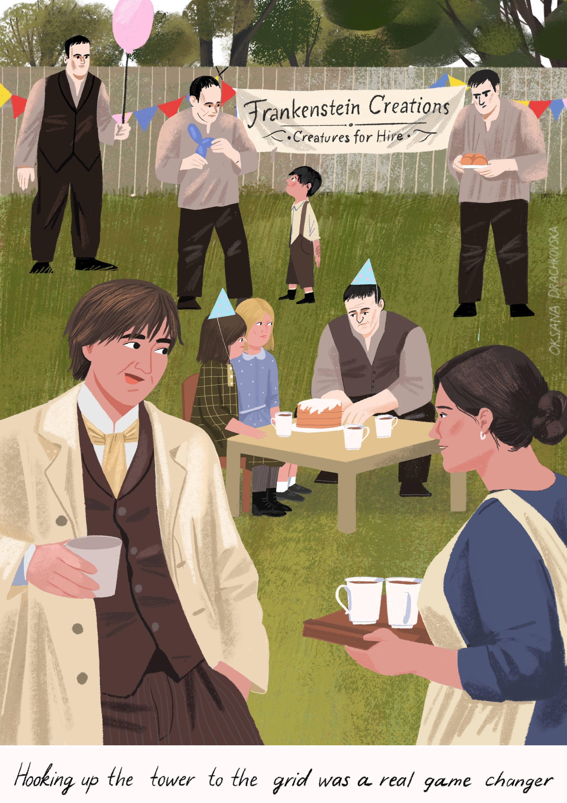

# Coal Panic¹

**Why every efficiency gain in sales has made everyone's job harder**

<!--
Published: February 2, 2026
-->

Every tool in the sales tech stack was built to make outbound more efficient. Every one of them made the channel worse. A 19th-century English economist observed something similar in coal.

<strong>The fuel that powered Empire</strong>

House of Commons, April 17, 1866. John Stuart Mill rises to address what he calls a looming resource crisis. The reckless consumption of coal is a "national sin" against future generations. The probable exhaustion of Britain's supplies, he warns, "is no longer a question of centuries, but of generations." He has read every attempt to refute the claim. None have succeeded — the best "has only made out that our supplies will continue a few years longer." Britain must pay down its national debt while the cheap supplies still last.

Two weeks later, William Gladstone, Chancellor of the Exchequer, delivers his Budget Speech. Coal, he tells the House, is the "special and peculiar source of the power of England."

Both had read *The Coal Question*, a book published a year earlier by a twenty-nine-year-old tutor at Owens College in Manchester.¹ William Stanley Jevons's insight was that improvements in the efficiency of the steam engine were not conserving coal but dramatically increasing its consumption. Coal was the fuel that powered the Empire, and Jevons had given Parliament reasons to believe that any future innovation would hasten the exhaustion of the prized mineral.

On June 12, a Royal Commission is appointed to investigate the claims. The newspapers call it the Coal Panic.² "The papers are hammering away about it," Jevons writes to his sister. "The Times accuses me of misleading Mr. Gladstone."

  

Jevons' charts. Is that your projected ARR?³

<strong>The World of Aaron</strong>

It's the end of summer, 2002. Aaron Ross drives through the morning fog of San Francisco on his way to his new gig at Salesforce. In his mind, a system is taking shape. Three years later, after huge success, he'll write it down and call it *Predictable Revenue*.

His timing is perfect. By the turn of the century, email had replaced fax as the default mode of corporate communication.⁴ The channel was open, uncrowded, and ready to be used.

The early days felt different from today. People complained about email almost from the beginning, but cold B2B outreach was minuscule compared to what it would become. A well-crafted, properly targeted, personalized email had a good chance of being opened and read.

Labor enforced a natural constraint. A human could write and send a small volume of high-quality emails, or a higher volume of mediocre ones. The tradeoff was real and unavoidable. Quality and volume were inversely linked.

The only way to increase volume without sacrificing quality was to hire more people. That made labor the binding constraint, which created pressure to get more output from each hire.

This is where Aaron Ross enters the story. His innovation at Salesforce was organizational: split prospecting from closing, create dedicated roles, measure the handoffs. The prospecting role became the SDR. The closing role became the AE. It was a Ford moment for sales. The assembly line applied to pipeline.

Once sales became an assembly line, the logic of the factory took over. How do you make an assembly line better? Speed it up, remove the bottlenecks, push more through.

  <link href="https://fonts.googleapis.com/css2?family=Source+Serif+4:opsz,wght@8..60,400;8..60,600&family=IBM+Plex+Sans:wght@400;500;600&display=swap" rel="stylesheet">

  

  

    

      
A human can only do so much

      
Conceptual

    

    

      

        
Quality vs Volume

        <svg class="chart-svg" viewBox="0 0 200 160" preserveAspectRatio="xMidYMid meet">
          <!-- Axes -->
          <line class="axis-line" x1="28" y1="136" x2="192" y2="136"/>
          <line class="axis-line" x1="28" y1="8" x2="28" y2="136"/>
          <!-- Labels -->
          <text class="axis-label" x="110" y="152" text-anchor="middle">Volume</text>
          <text class="axis-label" x="10" y="72" text-anchor="middle" transform="rotate(-90, 10, 72)">Quality</text>
          <!-- Line -->
          <path class="line-pre" d="M 36.2,19.52 L 183.8,117.44"/>
        </svg>
      

      

        
Performance vs Quality

        <svg class="chart-svg" viewBox="0 0 200 160" preserveAspectRatio="xMidYMid meet">
          <!-- Axes -->
          <line class="axis-line" x1="28" y1="136" x2="192" y2="136"/>
          <line class="axis-line" x1="28" y1="8" x2="28" y2="136"/>
          <!-- Labels -->
          <text class="axis-label" x="110" y="152" text-anchor="middle">Quality</text>
          <text class="axis-label" x="10" y="72" text-anchor="middle" transform="rotate(-90, 10, 72)">Performance</text>
          <!-- Line -->
          <path class="line-pre" d="M 36.2,125.76 L 183.8,20.8"/>
        </svg>
      

      

        
Performance vs Volume

        <svg class="chart-svg" viewBox="0 0 200 160" preserveAspectRatio="xMidYMid meet">
          <!-- Axes -->
          <line class="axis-line" x1="28" y1="136" x2="192" y2="136"/>
          <line class="axis-line" x1="28" y1="8" x2="28" y2="136"/>
          <!-- Labels -->
          <text class="axis-label" x="110" y="152" text-anchor="middle">Volume</text>
          <text class="axis-label" x="10" y="72" text-anchor="middle" transform="rotate(-90, 10, 72)">Performance</text>
          <!-- Line -->
          <path class="line-pre" d="M 36.2,28.48 L 183.8,126.4"/>
        </svg>
      

    

    

      

        

        Pre-automation
      

    

    

      In a pre-automation world, quality decreases with volume—a human can only do so much. Scaling volume forces performance to decline in lockstep, since quality drives performance.
    

  

<strong>At a bar</strong>

"So there's this SDR, she's great, gets replies nobody else gets. But her manager wants more volume and the problem is, the moment she cranks it up, quality tanks and replies drop."

"Right, she's the bottleneck."

"Exactly, and he just lost headcount, so the pressure is to make her more efficient. And that's what happened. Layer after layer of tools land on her. ZoomInfo gives her a database so she wastes less time guessing email addresses. Salesloft lets her run hundreds of prospects at once. Clay does the research. Lavender writes the emails. Every tool just makes sending cheaper. So obviously everyone sends more."

He paused to take a sip, winced. Still new to west coast IPAs.

"It's the law of demand, man. Every team with these tools sends more email. And here's the thing — the efficiency is never banked. Not once. Sure, you can do with one person what your team of five used to do, but you still got five.

Sending gets so cheap that whole new types of senders show up. Startups running sequences before they've hired a single salesperson. Agencies selling outbound for two grand a month. Freelancers on Upwork booking appointments. These are business models that couldn't have existed ten years ago.

And it's not just more senders. When outbound was expensive you only went after big deals. When it costs nothing to send, suddenly a five-thousand-dollar contract is worth a sequence. The target list explodes.

Anyhow, everyone's cold emailing now, so you gotta do it really well or you get crowded out." He takes another sip. "We have this new guy who's figuring all the new tooling out."

"That GTM engineer."

He nodded. Someone at the table flagged the bartender for another round.

"And the reason none of this ever slowed down, the reason nobody ever saved any of the efficiency, is that the costs land on someone else. You pay for Apollo. The VP whose coffee break just got swallowed by her inbox pays for everything else. There's no brake in the system. You never feel the cost of your own volume."

"So you're saying the cost of sending is fully externalized to the recipient, which brings the sender's marginal cost to near zero, price elasticity goes through the roof, and there's no signal left to constrain volume."¹⁵

"What?"

  <link href="https://fonts.googleapis.com/css2?family=Source+Serif+4:opsz,wght@8..60,400;8..60,600&family=IBM+Plex+Sans:wght@400;500;600&display=swap" rel="stylesheet">

  

  

    
The Stack: Seven layers of efficiency volume

    <table>
      <thead>
        <tr>
          <th>Layer</th>
          <th>What it solved</th>
          <th>Why volume followed</th>
        </tr>
      </thead>
      <tbody>
        <tr>
          <td>
            Contact data aggregation
            ZoomInfo, Apollo, Lusha, Clearbit
          </td>
          <td>Guessing email formats, patching multiple lists → unified and complete contact database.</td>
          <td>The addressable list grew overnight.</td>
        </tr>
        <tr>
          <td>
            Sequencing
            Outreach, Salesloft, Apollo, Instantly
          </td>
          <td>Sending emails one by one → automated cadences that send on schedule and track engagement.</td>
          <td>One rep could run hundreds of prospects simultaneously.</td>
        </tr>
        <tr>
          <td>
            Intent data
            Bombora, 6sense, G2, TrustRadius
          </td>
          <td>Guessing who was ready to buy → signals based on web behavior and content consumption.</td>
          <td>Signals created permission to reach new prospects.</td>
        </tr>
        <tr>
          <td>
            Enrichment
            Clearbit, Clay, UserGems, BuiltWith
          </td>
          <td>Researching each account manually → auto-filled company size, tech stack, funding, job changes.</td>
          <td>Research that took twenty minutes took seconds. Reps worked more accounts.</td>
        </tr>
        <tr>
          <td>
            Email warming
            Instantly, Warmbox, Lemwarm, Mailreach
          </td>
          <td>Domain sending limits → simulated engagement to accelerate ramp up.</td>
          <td>More volume was the point from the start.</td>
        </tr>
        <tr>
          <td>
            AI writing
            Lavender, Regie.ai, Copy.ai, Jasper
          </td>
          <td>Writing each email manually → generated or rewritten copy at scale.</td>
          <td>Removed the time cost of writing personalized emails.</td>
        </tr>
        <tr>
          <td>
            Signals / triggers
            Common Room, Koala, Pocus, UserGems
          </td>
          <td>Manually monitoring news and LinkedIn → automated alerts for job changes, funding, usage.</td>
          <td>Every trigger became a reason to reach out.</td>
        </tr>
      </tbody>
    </table>
  

<strong>Newcomen's engine doesn't fit the barbershop</strong>

In 1769, the bottleneck was the engine. The Newcomen, named after the Baptist ironmonger who built it in 1712 to pump water out of a coal mine, was so hungry for fuel that it could only operate where coal was essentially free — sitting on top of the pit it was draining.⁵ For sixty years it stayed there. Too hungry to move.

James Watt's separate condenser kept the cylinder hot instead of reheating it every stroke, while the steam collapsed elsewhere.⁶ Fuel consumption fell by roughly two-thirds. Mines that had been too expensive to drain became viable, and the ones already running pumped deeper. By 1781 Watt had converted the engine's motion into rotation. A machine that had spent six decades chained to a coal mine could now drive a loom in Manchester, a hammer in Birmingham, a lathe anywhere the price of coal was no longer prohibitive.⁷

Watt's engine first scaled up existing operations, then started showing up in places where a Newcomen would have been unthinkable. Coal consumption rose from roughly 16 million tons in 1829 to 72 million tons by 1861.⁸ "It is the very economy of its use which leads to its extensive consumption."

"It is wholly a confusion of ideas to suppose that the economical use of fuel is equivalent to a diminished consumption. The very contrary is the truth."⁹

That's the line that panicked Mill and Gladstone one hundred and sixty years ago.¹⁰

  

While the parallel with email is striking, coal use had brakes that cold email doesn't enjoy.

The fumes were someone else's problem. They didn't pay for it. We are.¹¹ But the coal user still had to pay for coal. You could put a Watt engine in a textile mill, in a forge, on a ship. You would not put one in a barbershop. At some point the cost of fuel made the next application absurd. The price of coal imposed a limit on where the engine could go. Email has no equivalent limit.

The guy at the bar got the externality right but he missed a second brake. As demand increased, mines went deeper, extraction got harder, and coal got more expensive. Rising consumption created rising costs that slowed itself down. A negative feedback loop.

<strong>Runaway warming</strong>

It's striking how similar the promise is for every new tool in the stack: "personalization at scale," or "quality that scales," or "more pipeline, less effort." Code for: send more bypassing the volume-vs-quality trade-off. The hypothesis always appears correct at first, and never stays correct for long.

When enough senders have the same tools, volume across the channel compounds. The guy at the bar showed us how. The inbox fills. And as it fills, the performance you'd expect for a given level of quality erodes. The well-researched, personalized emails our good SDR excelled at? Two years ago they got replies. Now they're drowning. Your quota didn't change, so you *have to* send more to compensate. This may work for some time, but then it doesn't, because everyone else did the same thing.

More volume, more saturation, less performance, more volume. The loop has no floor. Well, it does.

  <link href="https://fonts.googleapis.com/css2?family=Source+Serif+4:opsz,wght@8..60,400;8..60,600&family=IBM+Plex+Sans:wght@400;500;600&display=swap" rel="stylesheet">

  

  

    

      
When everyone has the same tools

      
Conceptual

    

    

      

        
Quality vs Volume

        <svg class="chart-svg" viewBox="0 0 200 160" preserveAspectRatio="xMidYMid meet">
          <defs>
            <marker id="arrowhead-h" markerWidth="4" markerHeight="4" refX="3.5" refY="2" orient="auto">
              <polygon points="0 0, 4 2, 0 4" fill="#9ca3af"/>
            </marker>
          </defs>
          <!-- Axes -->
          <line class="axis-line" x1="28" y1="136" x2="192" y2="136"/>
          <line class="axis-line" x1="28" y1="8" x2="28" y2="136"/>
          <!-- Labels -->
          <text class="axis-label" x="110" y="152" text-anchor="middle">Volume</text>
          <text class="axis-label" x="10" y="72" text-anchor="middle" transform="rotate(-90, 10, 72)">Quality</text>
          <!-- Lines -->
          <path class="line-pre" d="M 36.2,19.52 L 183.8,117.44"/>
          <path class="line-first" d="M 36.2,16.96 L 183.8,91.84"/>
          <!-- Arrow -->
          <rect class="arrow-bg" x="120" y="87" width="44" height="10" rx="1"/>
          <line class="arrow-line" x1="131.32" y1="82.24" x2="155.92" y2="82.24" marker-end="url(#arrowhead-h)"/>
          <text class="arrow-label" x="143.6" y="94" text-anchor="middle">Decoupling</text>
        </svg>
      

      

        
Performance vs Quality

        <svg class="chart-svg" viewBox="0 0 200 160" preserveAspectRatio="xMidYMid meet">
          <defs>
            <marker id="arrowhead-v1" markerWidth="4" markerHeight="4" refX="3.5" refY="2" orient="auto">
              <polygon points="0 0, 4 2, 0 4" fill="#9ca3af"/>
            </marker>
          </defs>
          <!-- Axes -->
          <line class="axis-line" x1="28" y1="136" x2="192" y2="136"/>
          <line class="axis-line" x1="28" y1="8" x2="28" y2="136"/>
          <!-- Labels -->
          <text class="axis-label" x="110" y="152" text-anchor="middle">Quality</text>
          <text class="axis-label" x="10" y="72" text-anchor="middle" transform="rotate(-90, 10, 72)">Performance</text>
          <!-- Lines -->
          <path class="line-pre" d="M 36.2,125.76 L 183.8,20.8"/>
          <path class="line-first" d="M 36.2,125.76 L 183.8,52.8"/>
          <!-- Arrow -->
          <rect class="arrow-bg" x="94" y="54" width="44" height="10" rx="1"/>
          <line class="arrow-line" x1="142.8" y1="51.52" x2="142.8" y2="70.72" marker-end="url(#arrowhead-v1)"/>
          <text class="arrow-label" x="136.8" y="61" text-anchor="end">Decoupling</text>
        </svg>
      

      

        
Performance vs Volume

        <svg class="chart-svg" viewBox="0 0 200 160" preserveAspectRatio="xMidYMid meet">
          <defs>
            <marker id="arrowhead-v2" markerWidth="4" markerHeight="4" refX="3.5" refY="2" orient="auto">
              <polygon points="0 0, 4 2, 0 4" fill="#9ca3af"/>
            </marker>
          </defs>
          <!-- Axes -->
          <line class="axis-line" x1="28" y1="136" x2="192" y2="136"/>
          <line class="axis-line" x1="28" y1="8" x2="28" y2="136"/>
          <!-- Labels -->
          <text class="axis-label" x="110" y="152" text-anchor="middle">Volume</text>
          <text class="axis-label" x="10" y="72" text-anchor="middle" transform="rotate(-90, 10, 72)">Performance</text>
          <!-- Lines -->
          <path class="line-pre" d="M 36.2,28.48 L 183.8,126.4"/>
          <path class="line-first-dotted" d="M 36.2,25.92 L 183.8,100.8"/>
          <path class="line-first" d="M 36.2,45.12 L 183.8,120"/>
          <!-- Arrow -->
          <rect class="arrow-bg" x="58.6" y="38" width="40" height="10" rx="1"/>
          <line class="arrow-line" x1="52.6" y1="36.16" x2="52.6" y2="52.8" marker-end="url(#arrowhead-v2)"/>
          <text class="arrow-label" x="58.6" y="45" text-anchor="start">Saturation</text>
        </svg>
      

    

    

      

        

        Pre-automation
      

      

        

        Automation
      

      

        

        Expected with Automation
      

    

    

      Automation decouples quality from volume—quality scales. But when everyone scales, saturation decouples performance from quality. The result: performance falls short of previous expectations at every level of volume.
    

  

This is what's going on at the moment. The inbox has filled. Open rates down double digits year over year.¹² SDR headcount cut by more than a third.¹³

Saturation is pushing senders to adjacent channels. Google Doc invitations with a pitch in the first paragraph. Slack Connect requests.¹⁴ Calendar invites. When the front door stops working, the bold are the ones who climb through the window.

<strong>PIZZA</strong>

Three years ago, his sequences got replies when no one else's did. Intuition, pattern recognition built over thousands of sends. His manager asked him to train new hires. His Salesloft templates made it into the onboarding deck.

Now the title is GTM engineer. The intuition he once applied manually now lives in Clay workflows that run while he sleeps.

7pm. He checks LinkedIn. Seventy-six likes on the diagram he posted last week. It's a beautiful schematic: signal capture, enrichment waterfall, branching logic based on intent scores. A VP of Sales he respects has commented: "This is gold 🔥." A dozen others are asking for the template.

He clicks to the next tab. His dashboard. Through the glass he watches three AEs grab their jackets, laughing, heading for the bar. Someone closed. Not from his flows. He stares at his screen.

Opens in the single digits. Two replies this week. One out-of-office. One that just says "PIZZA."¹⁶ He tightens a signal filter and queues the next batch.

His inbox pings. A college friend, working at a Series B in Austin, has forwarded a link with a one-line message: "have you seen this?"

The link points to 11x.¹⁷ He closes the laptop, eager to join everyone at the bar. Reopens it.

He clicks.

  

  

    
Takeaways

    <ul>
      <li><strong>The first bottleneck was the human.</strong> Quality and volume were inversely linked. The only way to scale was to hire more.</li>
      <li><strong>The stack made sending cheaper.</strong> Layer by layer, each tool removed a constraint. None of the savings were banked — they were re-spent as volume.</li>
      <li><strong>Jevons documented the same pattern in 1865.</strong> When something becomes cheaper to use, people use more of it. Every tool in the stack followed the same logic: efficiency in, volume out.</li>
      <li><strong>The cold emailer's costs land on the recipient.</strong> The coal user still paid for coal. The sender pays for Apollo. No cost signal, no brake on volume.</li>
      <li><strong>Coal slowed itself down. Email speeds itself up.</strong> Rising coal demand made coal more expensive. Rising email volume degrades the channel, forcing more volume to compensate.</li>
    </ul>
  

<strong>Footnotes</strong>

¹ The title refers to William Stanley Jevons, <em>The Coal Question: An Inquiry Concerning the Progress of the Nation, and the Probable Exhaustion of Our Coal Mines</em> (Macmillan, 1865).

² "Coal Panic" was the contemporary term used by newspapers and later by historians. See White, M.V., "Frightening the 'Landed Fogies': Parliamentary Politics and The Coal Question," <em>Utilitas</em> 3, no. 2 (1991), pp. 289–302.

³ From Jevons, <em>The Coal Question</em> (Macmillan, 1865). Four curves on a single plate: population of England and Wales, total imports, coal vend from Newcastle, and supposed consumption of coal in Britain — all going exponential at the same moment. The projected consumption curve shoots off the top of the page toward 2000. This is what freaked them out. Source: Wikimedia Commons, public domain. Original held at the Online Library of Liberty (Liberty Fund).

⁴ Multiple contemporaneous surveys and industry reports place the standardization of email in U.S. corporate communication at the turn of the century. By 2001–2002, email was near-universal among white-collar workers and had overtaken fax as the default medium for routine business correspondence (Pew Internet & American Life Project; IDC; Radicati Group).

⁵ Newcomen's engine, erected at a colliery near Dudley Castle in 1712, is generally credited as the first practical steam engine. "Practical" is doing real work in that sentence — earlier devices existed, but they had an alarming tendency to explode. The Newcomen's thermal efficiency was roughly 0.5%: for every hundred units of energy in the coal it burned, it converted about half a unit into useful work. At any distance from the coal face, the economics were impossible. At the mine mouth, the fuel was waste rock. The engine survived not on engineering merit but on zero-cost inputs — a structure that will reappear later in this series.

⁶ Watt's insight reportedly came during a Sunday walk on Glasgow Green in 1765, four years before the patent. He was thinking about a Newcomen model he had been asked to repair for the university's natural philosophy department. The story has the suspiciously clean shape of founding mythology, but Watt told it consistently for the rest of his life, and no one has been able to improve on it.

⁷ The partnership between Watt and Matthew Boulton, a Birmingham manufacturer with the capital and business sense Watt lacked, is one of the great complementary pairings in industrial history. Boulton built the business model: licensing Watt engines and charging a royalty based on the fuel savings compared to a Newcomen. They literally priced their product as a fraction of the efficiency gain. Sales engineers have been doing this ever since.

⁸ These figures are drawn from Jevons's own tabulations in <em>The Coal Question</em>, Chapter III. The trajectory is not linear but exponential — consumption roughly doubling every twenty years through the first half of the nineteenth century.

⁹ Jevons, <em>The Coal Question</em>, Chapter VII. The full passage continues: "As a rule, new modes of economy will lead to an increase of consumption."

¹⁰ Jevons was wrong about the exhaustion. Britain did not run out of coal. The Royal Commission confirmed his numbers but not his despair — Britain had more coal than he thought, and eventually found substitutes: oil, gas, nuclear. Whether cold email has an equivalent exit is less clear. Every adjacent channel — phone, LinkedIn, Slack, calendar invites — draws from the same finite resource: the recipient's attention. Coal had substitutes. Attention may not.

¹¹ Jevons focused entirely on the input side of the ledger, fearing that depletion of British coal reserves would collapse the empire's industrial supremacy. He was blind to the output side: the waste product of that supremacy would outlast the empire itself. While he worried the pantry was running bare, the house was silently filling with smoke that would not clear for a hundred generations. The CO2 released by Victorian-era coal combustion is, in a meaningful sense, still in the atmosphere. About half of any CO2 pulse is absorbed within a century, but a long tail of 20–35% persists for thousands of years, awaiting the slow chemistry of rock weathering. See David Archer, <em>The Long Thaw</em> (Princeton, 2009).

¹² B2B cold email open rates fell from ~36% to ~27-28% year over year. Reply rates dropped from ~6.8% in 2023 to ~5.8% in 2024. (Belkins 2025 B2B Cold Email Study; Martal Group 2025 Cold Email Statistics)

¹³ Emergence Capital's 2024 "Beyond Benchmarks" study of 560+ B2B SaaS companies found 36% decreased SDR/BDR headcount—the highest reduction rate of any sales role. Only 19% increased SDR teams, the lowest expansion rate across sales functions. (SaaStr)

¹⁴ Slack Connect requests come with embedded sequencing: Slack sends up to four reminders to accept a pending invitation before it expires. Unlike email, these notifications always pass through—no spam filter to clear. Please don't tell the SDRs.

¹⁵ Price elasticity of demand measures how much the quantity demanded changes when price changes. When the sender's marginal cost approaches zero — because the real costs are borne by the recipient — even a small reduction in sending cost produces a massive increase in volume. In economic terms, demand becomes nearly perfectly elastic with respect to private cost.

¹⁶ "Reply PIZZA" was a viral opt-out tactic from 2023. It started as a pattern interrupt—something unexpected to break through inbox fatigue. It ended as a marker of exactly the kind of email people were trying to avoid.

¹⁷ 11x is one of a growing number of companies selling AI agents that perform the SDR's job autonomously: finding prospects, writing emails, sending sequences, handling replies. Another, but very special for specific reasons, Watt engine.

