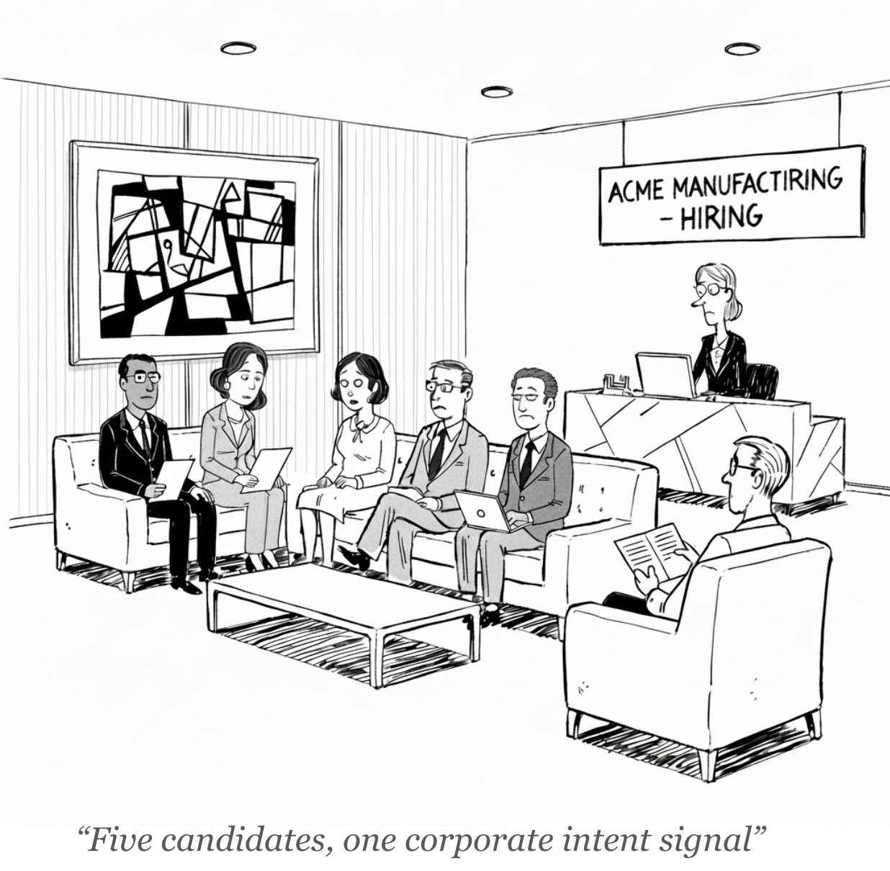

# Explainer: Intent Data

**What is "Intent Data", how is it manufactured, and why is it (probably) wrong most of the time.**

<!--
Published: October 23, 2025
-->

The promise of intent data is to replace guesswork with a clear signal of who will buy next.  
The flaw in the promise is that this signal is not a direct measurement of interest, but a  
low-fidelity guess dressed up to look like a data point worth acting on.

**The next buyer question**

Every go-to-market leader is vexed by the same question: who is ready to buy right now?  

In pursuit of an answer, an industry formed around an irresistible promise: the power to see  
tomorrow’s buyers before they raise their hands, to replace guesswork with data. This  
promise has fueled a multi-billion dollar market, with over 70% of B2B go-to-market teams now  
using intent data in some form.  

Yet for a product this valuable, its origins are surprisingly opaque. To understand what’s really  
being sold, it helps to follow the trail back to its source.  

**Bidstream: the raw material**

The story begins, unexpectedly, in advertising.

When a webpage loads, the empty rectangle where an advert will appear doesn’t yet have a buyer. In the milliseconds before it becomes visible, an automated dynamic auction takes place. Hundreds of bidders receive a tiny packet of data — the page’s topic, device type, rough location, and IP address — and decide whether to bid. If that packet shows a reader in Florida in July, for instance, air conditioner companies are far more likely to bid higher and win the auction.

The primary purpose of each dynamic auction is to sell a single ad impression, so the value of the broadcasted data packet was never intended to be more than ephemeral, lasting only long enough to price that one moment of attention.

But publishers and ad exchanges soon realized there was a by-product — the trail of metadata left by billions of such auctions — that was a valuable asset in its own right. This aggregate trail is the **bidstream**. A secondary market quickly formed, with data brokers emerging to buy, aggregate, and resell this torrent of data.

**Guessing and dressing identities**

The enrichment vendors that buy these feeds face a simple obstacle: the data show what  
pages were viewed, but not who viewed them. To turn a potential intent signal into  
something a marketeer or salesperson can act on, they must first guess which company it  
came from.  

That task falls to IP-mapping vendors like KickFire, Clearbit Reveal, and Leadfeeder. They  
maintain huge databases linking IP address ranges to corporate networks. Some of those  
links come from public routing records — the internet’s address book — but most are  
inferred from observation. If traffic from a certain range keeps hitting both Salesforce  
documentation and Salesforce’s careers page, the algorithm quietly labels that network  
“Salesforce.”  

Once the web traffic is associated with companies, enrichment firms take over. They classify the pages being read into business topics like “HR system migration,” “payroll software,” or “Workday alternatives.” When enough visits from one network cluster around a theme, the system records a “topic surge.” Some vendors go further, layering in other data points—hiring trends, funding rounds, technology installs—to build what they call "composite intent signals", the claim being that combining many weak indicators yields a stronger, more reliable signal.

**To put a bow on it**

By now, the data has already passed through several hands. The ad exchange sells the packet, the broker sells the feed, and a chain of specialists reshapes it: IP-mapping firms guess which company each address belongs to; enrichment vendors classify pages into business topics and aggregate these patterns into the composite “intent” scores. 

And finally, platform integrators like ZoomInfo and 6sense package this manufactured signal for go-to-market teams. Marketing uses it for account-based targeting; sales uses it to prioritise outreach. The dashboard turns those probabilities into something that looks decisive: *“Acme Manufacturing - HR system migration interest up 28% week over week”*.

<!--

  

-->

**Acme Manufacturing**

Lean back and watch the full motion unfold.  

A job candidate, connected to the guest Wi-Fi while waiting in the lobby of Acme  
Manufacturing, scrolls through the websites of Workday and BambooHR: two other firms  
where he’s also applied for roles.  

Each site he visits fires a bidstream ping. An ad exchange broadcasts the details; a data  
broker captures the packet and sells the feed. Days later, at an enrichment firm, that lobby  
Wi-Fi’s IP address is matched to Acme Manufacturing, the candidate’s browsing is tagged as  
corporate-level interest in “HR system migration,” and the activity registers as a surge.  

The surge alert enters BambooHR’s marketing automation system, where Acme  
Manufacturing’s account score ticks upward, finally hitting some arbitrary threshold, which  
flags it as a Marketing-Qualified Account and routes it to Sales. A task is queued in the CRM  
for John, an SDR at BambooHR. After returning from his coffee break, he places a call.  

The phone rings in the office of Acme’s Head of People Ops, the very manager who  
interviewed the candidate. She picks up, still drafting a polite rejection note, and hears:  

> “I noticed you’re exploring new HR systems.”  

**Where the guesswork breaks**

The common critique of intent data is that its signal is weak because context is lost at each  
step: turning a page view into an IP address, an IP into a company, and a company into a  
trend. But this framing is too generous. It implies a real, person-level signal existed at the  
start, only to be stripped of its meaning.  

The opposite happens. The process begins with something inherently indeterminate —  
anonymous web traffic¹ — and adds layers of conjecture. Fidelity isn’t lost; it’s invented,  
dressing up a statistical guess until it looks like a data point worth acting on.  

The weakest link is **identity mismatch**, the attempt to map that anonymous web traffic to  
a specific company. Audits put accuracy near 40–50%, far below the 80–90% vendors claim.  
Remote work, shared offices, and cloud infrastructure all blur IP identity. Two providers may  
disagree on which company an IP belongs to, so the same browsing activity can register as  
intent from entirely different firms. And even when they’re right, the match only narrows the  
activity to a company, never to a person.  

The next distortion is **manufactured statistical certainty**. Composite scoring blends different data types — hiring surges, funding rounds, new software installs — to make a weak signal look stronger. But these signals are rarely independent. A company that has just raised funding is also likely to be hiring and buying software. Since the clues point to the same underlying event, they don’t triangulate a target, they simply reinforce one assumption. The model grows more confident without becoming more accurate, mistaking correlation for certainty.

Another flaw is **semantic drift in topic detection**. Every “surge” depends on vendor-specific  
taxonomies — “HR software,” “contract management,” “cloud migration” — derived from  
automated classifiers that interpret page text and metadata. Vendors revise these opaque  
taxonomies without notice, so changes in classification often reflect model drift, not market  
behaviour. A single page can be labeled differently across providers or model versions,  
creating semantic drift that mirrors shifts in the classifier, not in buyer intent.  

The final limitation is **latency**. The auction that produces the bidstream happens in  
milliseconds; the enrichment and reporting cycle takes days or weeks. By the time a score  
appears in a dashboard, the behaviour it describes is often already stale.  

¹ A curated alternative to the raw bidstream is the data cooperative model, often associated with vendors like Bombora. In this model, a network of B2B publishers agrees to share anonymized visitor data, yielding a higher-quality signal about the topic being researched (the what). Crucially, however, it still depends on the same probabilistic IP-to-company mapping to determine where that research originates (the who), and therefore does not solve the fundamental identity and context challenges outlined here.

**The industrial logic**

Yet the system endures, and for rational reasons. Weak signals are not worthless. In a  
high-volume outbound model, even a tiny probabilistic edge compounds at scale. A one- or  
two-point lift in response rate, spread across thousands of prospects, pays for itself many  
times over.  

That’s why intent data fits so neatly into the industrial go-to-market philosophy: it offers  
direction: just enough to keep the outbound factory running, turning a small statistical edge  
into a licence for volume.  

**The vanishing raw material**

The industry has long weathered scrutiny over the unreliability of its manufactured signals.  
But it now faces a truly existential threat, one that targets not the quality of the signal, but  
its very existence. The entire market was built on a single, fragile assumption: that the  
torrent of human curiosity, expressed as page views, would flow forever.  

That assumption is now breaking.  

As AI assistants handle more of the early research process, users get answers without  
opening a page. In 2024, SparkToro and SimilarWeb found that more than 65% of Google  
searches ended without a click — a record high — and early evidence suggests AI answer  
boxes will push that number higher still. Publishers see the same trend: Semrush and  
Parse.ly report year-on-year declines in organic traffic across B2B and informational sites.  

For business buyers, the shift is sharper. A procurement manager who once searched “best  
contract-management software” now asks ChatGPT or Claude and receives a synthesised  
answer instantly. No page view means no auction, no bidstream, and nothing to map.  

This shift to conversational AI presents a fundamental challenge. Unlike the open web,  
where actions are public by default, these new interfaces are private. As research activity  
moves from public web pages to private AI chats, the visibility required for bidstream  
auctions disappears.  

The raw material of this market is human curiosity expressed as a page view, and the  
industry is running out of curiosity to sell.
