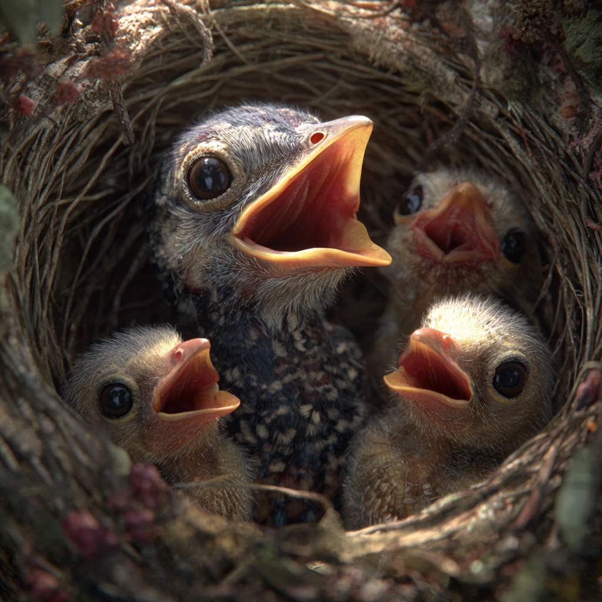
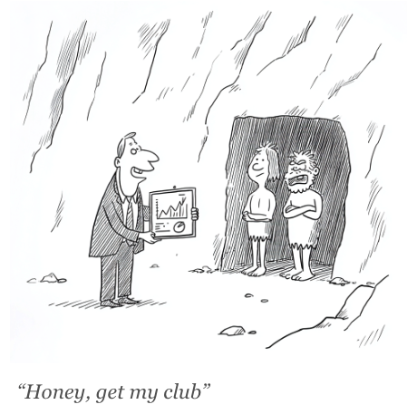

# Parasitic Sales

**How companies hijack your instincts to keep you on the line**

Published: August 11, 2025

**A visitor in the nest**

The cuckoo watches from a hidden perch, waiting for the warbler to leave its nest. As soon as the coast is clear, she flies in, lays her egg in seconds, and takes off, often carrying away one of the originals to keep the number the same.

Soon after, the warbler returns. Inside are eggs that look exactly like hers. She settles in, warming them without the slightest suspicion.

The match is so close the warbler does not notice the intrusion. That cuckoo egg hatches earlier than the rest, revealing a chick already larger and stronger. Within days, it pushes the other eggs, her own offspring, out of the nest entirely.

She continues to feed it because the cuckoo chick has evolved to trigger her parental instincts with ruthless precision. The colour of its gape, the pitch of its begging call, and the timing of its hunger are tuned to match or outcompete her own young. Evolutionary biologists call this brood parasitism, the exploitation of one species’ instincts by another.

  

Richard Dawkins, in *The Selfish Gene*, uses the cuckoo as a vivid example of how natural selection favours strategies that exploit pre-wired behaviours. What’s striking is not that the warbler loses, but that it loses by doing exactly what it has evolved to do. The cuckoo does not need speed or force. It wins by presenting the right signals in the right sequence and letting instinct carry out the rest.

The deception works because it targets instincts that cannot be switched off. Even when the truth is obvious, the impulse to feed still wins — much like picking up the phone out of habit when an unfamiliar number flashes on the screen.

**Our own wiring**

We like to think of ourselves as different from the warbler. After all, we’ve got consciousness, reasoning, choice. Surely that protects us from being manipulated by a beak and some chirping.

But we also run on instincts — survival mechanisms shaped over hundreds of thousands of years in an environment where living in a group was the difference between life and death. Politeness, reciprocity, and conflict avoidance weren’t “nice-to-haves.” They were survival code. In small, tightly knit groups, returning a favour kept you in good standing. Avoiding unnecessary conflict meant fewer injuries and stronger cooperation when hunting or defending the group. Responding when addressed signalled awareness and respect, reinforcing bonds that might one day save your life.

Over many generations, these behaviours became second nature, reinforced by the survival advantages they brought in the ancestral environment. Those same reflexes now operate in a world of call queues, unknown numbers, and scripted pitches. And like the warbler’s feeding reflex, they can be triggered by the right cues, whether or not the source is genuine.

**The phone rings**

Your phone rings. The number’s unfamiliar.

You could ignore it, but curiosity, another ancient instinct, taps you on the shoulder. You pick up.  
The voice on the other end is warm, confident, friendly. They use your name. They ask how you are, and you answer automatically, even though you’ve never met. Only a few seconds in do you realise this is the electricity company, the one that calls every few months with a “special rate” that somehow always turns out higher than the one you have now.

There’s a shift: part irritation, part guilt. You want to hang up. You also don’t want to be rude.  
It’s a small but effective trap. You know you don’t want what they’re offering — yet the polite thing to do, the instinctive thing, is to hear them out.

  

**A fine-tuned system**

The only thing that matters to the people running it is conversion. And conversion goes up when you stay on the line. Whether it’s because the person in charge of outbound is consciously borrowing from the cunning of the cuckoo, or simply the cumulative result of decades of trial and error in call centres (just like biological evolution), we’ve ended up with a system that essentially hijacks your social instincts.

The friendly opening. The first-name greeting. The pace and tone of the voice. Each detail tested, refined, and sharpened until it tugs at your wiring just enough to keep you from hanging up.

What I find most irritating is that the people who sign off on these tactics will never face you. They don’t hear the sigh in your voice or feel the tension of staying polite while someone burns your time. That part is outsourced to the people on the phones, often underpaid, under pressure, and not to blame for the strategy they’re carrying out.

Your frustration has nowhere to go. You hang up, but the system remains untouched. And each call makes you fractionally quicker to cut the next one short.

**The numbers**

In Q1 2025, consumers in North America and Europe were hit with 12.5 billion spam and fraud calls; about 137 million a day. Spam now makes up 44 % of unidentified calls in France, 42 % in Spain, and 22 % in the U.S. (Hiya, Q1 2025; Q3 2023).

So it’s no surprise that 94 % of European consumers believe unidentified calls are likely spam or fraudulent (Hiya/GSMA, 2022). The share of adults who usually answer unknown numbers has collapsed over the last decade — to 19 % in the U.S. (Pew, 2020) and 28 % in the UK (YouGov, 2022) — and the real surprise is that those figures aren’t even lower.

Each unwanted call trains us to be quicker to hang up—or never pick up—on the next one. The damage compounds, and over time answer rates fall and conversion follows. No amount of brand spend buys that back. The irony is that companies can spend millions polishing their brand and, in the same quarter, grind it down with tactics that make people less likely to ever pick up again.

**Just hang up the phone**

If a reed warbler could suddenly understand the cuckoo’s trick, it wouldn’t hesitate. It would shove the cuckoo chick over the edge the moment it recognised the threat.

The chick itself isn’t the villain, but it’s still part of a parasitic system. Same with the voice on the line: they’re just the visible part of a machine built to drain your time for someone else’s gain.

Once you spot the pattern, hanging up is not only perfectly reasonable — it’s an act of self-protection. Your attention and goodwill are finite, and the system is designed to spend them. You’re under no obligation to feed it.

