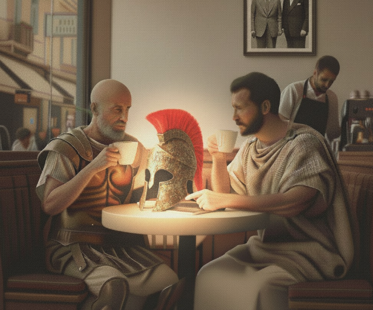

# Praxos vs. Cleanthes

**Six strong arguments for conventional outbound, and the case for a cleaner alternative.**

<!--
Published: September 6, 2025
-->

Steam hissed from the espresso machine, a counterpoint to the clink of ceramic. Praxos slid into the booth with the unhurried haste of a man who lives on calendars and quota math. Cleanthes was already there, hands around his cup as if coaxing a confession from it. The small talk, if there had been any, was already exhausted.

PRAXOS: You have the luxury of paragraphs. I live in dashboards. Outbound works because it’s a controllable input. I turn a dial, meetings appear. It isn't pretty, and Lord knows people hate it, but my board doesn't fund pretty. They fund a healthy, predictable pipeline.

CLEANTHES: Pipeline is oxygen. I’m not here to argue against breathing. I’m here to ask what your lungs are made of. If every breath deposits a little scar tissue, at what point do you stop calling it health?

PRAXOS: Spare me the poetry. Let’s speak plainly. Outbound is math. Two SDRs—my kids making the calls—one good list. One hundred touches a day. A handful of meetings, a couple of opportunities, one closed deal. The rest is rounding error.

CLEANTHES: What's in the “rounding error” column, Praxos? Wasted focus. The friction you pushed onto strangers. The filters you helped train to ignore you. The future buyers who now associate your brand with interruption. You keep the revenue on your P&L and push the cost onto the market's balance sheet. A debt like that always comes due.

PRAXOS: So you frame it as a moral question. Fine. I’m not allergic to morality, but I am responsible for keeping the lights on. Let's get serious. I'll give you the strongest case for conventional outbound. You try to break it.

<!--

  
  
"I swear, this toga turns every revenue call into Thermopylae"

-->

**ARGUMENT #1: IF WE DON’T OUTBOUND, WE DIE**

Praxos leaned forward, the energy in the booth shifting from debate to deposition.

PRAXOS: One: We are small. We have no gravity. Without a brand, without content, without events, we have two levers that move without asking permission: knock on doors and shout into inboxes. We pull those levers, or we die. Don't tell me to wait for word of mouth. Payroll is on Friday.

CLEANTHES: When the only tool you have is a hammer, every problem looks like a nail you have to hit a hundred times. I remember the panic of that payroll. The mistake is to let panic write your strategy. You're right, you have to create motion. But spray and pray creates heat, not light. Precision creates a light that compounds.

PRAXOS: Heat is a signal. Heat is meetings. Heat is a pulse. You talk about ‘light’ as if it’s some immaculate thing we can discover through quiet contemplation. A startup can’t afford analysis paralysis disguised as ‘precision.’ We find the light by creating heat. We make a hundred calls to learn what the ten best calls would have been. There is no other way.

CLEANTHES: I’m not arguing for contemplation. I’m arguing for leverage. A good general doesn't send his entire army to probe the enemy's line. He sends scouts, gathers intelligence, and then concentrates his force where the wall is weakest. That is not paralysis; it is strategy.

PRAXOS: Sometimes you don’t know where the wall is weakest until you’ve touched all of it. Volume is how you discover the map.

CLEANTHES: Then let’s discover on purpose. Small, capped sampling passes to learn, freeze to think, and only then concentrate fire where the veins are live. Use volume for discovery, but focus for yield.

**ARGUMENT #2: IF THEY KNEW WE EXISTED, THEY’D WANT US TO EMAIL THEM**

PRAXOS: Your entire model is based on a flawed premise: that we need to discover where the value is. It’s a luxury of the uncertain. We already know the value. We know the pain is real. The only variable we need to solve for is reach, and that brings me to the foundation of my second point: we are not selling snake oil. We fix a real, painful problem. The introduction is cold because the world is noisy, not because our intent is malicious. If they knew what we do, they'd thank us for the interruption.

CLEANTHES: Good intent doesn't absolve you of the cost of your delivery. It's the difference between a tap on the shoulder and tapping everyone in the room because one of them might have a headache.

PRAXOS: Your analogy is flawed. This isn't a quiet room; it's a storm. A battlefield. A tap on the shoulder is silence. It gets lost. You need a signal flare to be seen through the chaos. The minor annoyance of that flare is a tiny price to pay for the person who is truly lost and needs rescue. We are selling rescue.

CLEANTHES: Then the goal isn't to be a louder flare, Praxos. It’s to be a smarter one. The world is awash in noise. The only way to cut through it is not with volume, but with relevance. That's the different frequency. You make the flare itself a gift of value—an insight, a piece of data, a benchmark they actually don’t have—so that even those who don't need rescuing are glad they looked up. That is how you earn the right to send the next one.

**ARGUMENT #3: MY REPS HAVE MORTGAGES (SO DO I)**

PRAXOS: Gifts of value… you make it sound like we’re a think tank. We are a sales floor. We try. We add insights. You know what happens. Silence. Unsubscribes. And then the meetings. Not many, but enough. The board doesn't applaud our ethics. They applaud our bookings. Which brings me to my third point.

Praxos’ voice dropped, the bravado replaced by a raw, immediate pressure.

PRAXOS: My reps have mortgages. So do I. I need a plan that closes a gap *now*.

CLEANTHES: And I respect that pressure. More than you know. I've been the one staring at that calendar... But the desperate sprint to solve for now is precisely why you're always in this crisis. It’s a treadmill. You’re burning all your energy just to stay in the same panicked place, quarter after quarter. The speed you feel is an illusion, paid for by making next quarter harder. The only way to close the gap sustainably is to stop digging the hole deeper.

PRAXOS: You're talking about next quarter. My CRO asks me, ‘How many meetings did your team book this week?’ Your philosophy is a fine retirement plan, but I’m fighting a war this quarter. Brand equity and trust don’t show up on a weekly dashboard. I can’t report vibes on Tuesday.

CLEANTHES: Then don’t report vibes. Report efficiency. For every thousand doors you knock on, how many real conversations do you start? Not just meetings, but actual positive replies. And track the opposite. How many people slam the door in your face—the unsubscribes, the spam reports? That’s not a vibe, Praxos. That's your supply line. It is the earliest possible signal of the health of the ground you're drilling in.

PRAXOS: That sounds slow. All that upfront research, building new rails for tracking... what if the “perfect well” is dry? And how does that help my rep who is at 20% of their monthly quota on the fifteenth?

CLEANTHES: You don't turn off the old engine before the new one is running. You dedicate a small, protected fraction of your effort to being geologists. Not for a whole quarter, but for a single, focused sprint. The goal in that sprint isn't to close deals; it's to build a better map. To conduct a short survey of the terrain and find the richest ground. If you don't find a stronger signal with less resistance, you stop. The experiment is small, the risk contained.

**ARGUMENT #4: I CAN’T PLAY CLEAN IF THE GAME IS RIGGED**

PRAXOS: A bet. That’s what it is. And it ignores the game-theory angle. My competitors are fighting a knife fight. If I play clean while they all defect, I'm the sucker who loses. My primary duty is to help my team win. To tell my soldiers to bring a polite letter to a knife fight is professional malpractice.

CLEANTHES: You're right. In a knife fight, bringing a letter gets you killed. But you're looking at the wrong fight. You're so focused on the man with the knife in front of you that you haven't noticed the arena's walls are closing in on you both. The spam filters, the call screeners... the buyer's cynicism: that is the real opponent. Your competitor's knife can't touch it. But every time he swings wildly, he makes that wall move a little faster for everyone, including you.

**ARGUMENT #5: OUTBOUND KEEPS THE ECONOMY MOVING**

PRAXOS: Even that frame is too small. We're talking about tactics. Let's talk about GDP. Let's talk about jobs. What do you think we do? We move value from where it is created to where it is needed. That is the foundational act of any economy. Without a proactive sales motion, great products die on the vine. Companies stagnate. Hiring freezes. Every annoying email is a tiny, fractional cost of that gigantic value creation. It is the cost of doing business. Not my business. All business.

CLEANTHES: I would never argue against connecting solutions to problems. The question isn't whether we should connect, but how. You’re defending the efficiency of the engine by ignoring the cost of the fuel. What is the cost in broken trust? In the cynicism that now blankets the entire profession? An economic system that runs on burning trust is, by definition, unsustainable.

**ARGUMENT #6: THE MARKET LEARNS BECAUSE WE POKE IT**

PRAXOS: Unsustainable? It's the only thing that creates what's next. A sustainable, 'clean' system is a closed loop. My final point is this: true innovation doesn't ask for permission. The market learns because we poke it. Our job is to solve problems people don't even have the language for yet. That requires interruption. You're arguing for a cleaner river. I'm arguing that the river's current is what powers the whole damn city.

Cleanthes nods slowly.

CLEANTHES: That is the most honest defense I have ever heard. And you are right: progress doesn't ask for permission. But you're confusing the act of exploration with the method of clear-cutting. History has two explorers: the wildcatter who drills a hundred holes hoping to get lucky, and the geologist who studies the terrain to know where to drill one. Both are proactive. But only the geologist's model compounds. The wildcatter's depletes. That's the difference. Clean isn't about waiting for permission. It’s about earning the right to interrupt through the sheer quality of your hypothesis.

**Spare me the philosophy: what does my BDR do at 9 a.m.?**

Praxos stared into his empty cup for a long moment, turning it slowly on the saucer. The aggressive certainty had finally settled, leaving a quieter, more pragmatic weight in its place.

PRAXOS: A geologist, huh? ...You're still smuggling aesthetics in as ethics. But you've at least grounded it in a logic of efficiency. So let’s be specific: What happens when the geologist's map is wrong? When the single, perfect well comes up dry and the calendar is empty on the fifteenth of the month?

CLEANTHES: Then you have a reserve of higher-friction plays you use like an emergency flare, not like your daily strategy. You run them with integrity, you learn from it, and you improve the map. This isn't about purity. It's about stewardship.

PRAXOS: You gave me an ethos. I asked for a checklist.

CLEANTHES: The checklist is the shadow of the ethos. I'll bring you both. We'll build it so your team can run it without guesswork. If it doesn’t move your numbers, throw it out.

PRAXOS: Bring me the checklist. And the dashboard that proves your signals are improving while the calendar fills. The numbers will make it culture.

CLEANTHES: Deal.

The barista called out an order. The steam wand hissed once more, steady and indifferent.

<!--

  

-->

