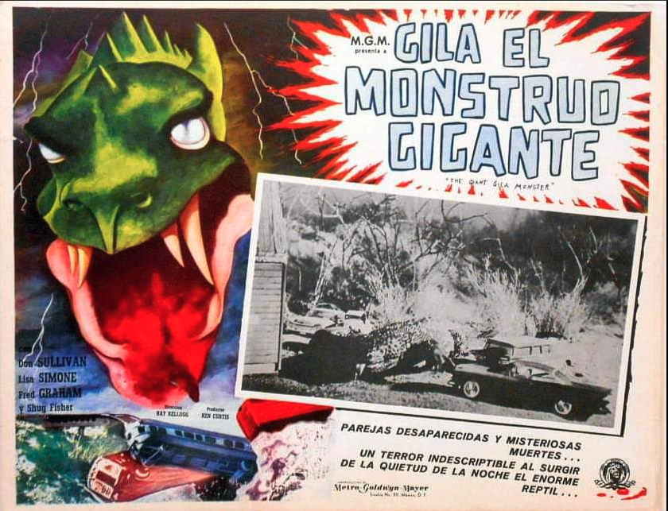

# Sellers and Zebras

**The psychology of selling no one talks about**

<!--
Published: February 27, 2026
-->

A thirty-year research program on primate stress maps uncomfortably well onto the SDR's workday. Automation eased the biological pain of selling but made other things worse.

<strong>Dissonance for Breakfast</strong>¹

> "If I KNOW 97% of these people don't need what I'm selling right now, and I email them anyway, it feels like I'm just playing the lottery with their attention." — kubrador, r/sales

> "If I got as many cold emails as these people, I'd ignore me too." — anonymous SDR, r/sales

> "I'm one of the spammers... and all the emails are automated. Don't feel bad. I know 95% are going straight in the trash." — HealthcareMadeEasySM, r/humanresources

<strong>El Monstruo Gila</strong>

"The faster you interrupt action in your counterpart's amygdala, the part of the brain that generates fear, the faster you can generate feelings of safety, well-being, and trust."

That's Chris Voss, *Never Split the Difference*, 2016. Voss is describing what happens inside a buyer's brain when a salesperson makes contact.

It is a popular way of framing the seller-buyer interaction. Oren Klaff calls it the "croc brain." Patrick Renvoisé calls it the "old brain," the "reptilian brain." Brian Tracy calls it Generalized Sales Resistance, a form of self-defense. In this literature, the roles are clear: the buyer is the prey animal. The seller is the approaching predator, the thing that triggers fight or flight.

<!-- [EXHIBIT: Guru table] -->

  <link href="https://fonts.googleapis.com/css2?family=Source+Serif+4:opsz,wght@8..60,400;8..60,600&family=IBM+Plex+Sans:wght@400;500;600&display=swap" rel="stylesheet">
  
  

    

      
An Onion With a Tiny Reptile Inside

      

        How sales gurus frame the seller-buyer interaction.
      

  <table>
    <colgroup>
      <col style="width: 25%">
      <col style="width: 60%">
      <col style="width: 15%">
    </colgroup>
    <thead>
      <tr>
        <th>Guru</th>
        <th>What they say</th>
        <th>Whose brain?</th>
      </tr>
    </thead>
    <tbody>
      <tr>
        <td class="guru">Oren Klaff, <em>Pitch Anything</em> (2011)</td>
        <td class="quote">"Because the <strong>croc brain</strong> has a short battery life and limited processing power, it is primarily focused on <strong>survival</strong>. If your message seems abstract or complex, the <strong>croc brain</strong> will perceive it as a <strong>threat</strong> and trigger the urge to <strong>flee</strong>."</td>
        <td class="brain-tag">Buyer</td>
      </tr>
      <tr>
        <td class="guru">Chris Voss, <em>Never Split the Difference</em> (2016)</td>
        <td class="quote">"The faster you interrupt action in your counterpart's <strong>amygdala</strong>, the part of the brain that generates <strong>fear</strong>, the faster you can generate feelings of safety, well-being, and trust."</td>
        <td class="brain-tag">Buyer</td>
      </tr>
      <tr>
        <td class="guru">Jeremy Miner, NEPQ (2021)</td>
        <td class="quote">"I was triggering <strong>fight or flight mode</strong> and what we call their <strong>survival part of their brain</strong> simply by using words that they're already familiar with that every salesperson uses and the same tonality."</td>
        <td class="brain-tag">Buyer</td>
      </tr>
      <tr>
        <td class="guru">Mark Goulston, <em>Just Listen</em> (2009)</td>
        <td class="quote">"When you're terrified, the <strong>amygdala</strong> in your mid-brain can boil over and shut down your upper brain, so you lose your reasoning capabilities... Psychologist Daniel Goleman calls this the <strong>amygdala hijack</strong>."</td>
        <td class="brain-tag">Buyer</td>
      </tr>
      <tr>
        <td class="guru">Brian Tracy, <em>The Psychology of Selling</em> (1988)</td>
        <td class="quote">Most prospects have "<strong>Generalized Sales Resistance</strong>." It's normal and "a form of <strong>self-defense</strong>."</td>
        <td class="brain-tag">Buyer</td>
      </tr>
      <tr>
        <td class="guru">Patrick Renvoisé, <em>Neuromarketing</em> (2007)</td>
        <td class="quote">"The <strong>old brain</strong> is a primitive organ... It is our '<strong>fight or flight</strong>' brain — our <strong>survival brain</strong> — and is also called the <strong>reptilian brain</strong>."</td>
        <td class="brain-tag">Buyer</td>
      </tr>
      <tr>
        <td class="guru">Colleen Stanley, <em>EI for Sales Success</em> (2013)</td>
        <td class="quote">"Your <strong>old brain</strong> takes over causing you to go into <strong>fight or flight</strong> behavior. As a result, your heart rate increases and <strong>adrenaline and cortisol</strong> are released affecting clarity of thought. In other words, you're left with the thinking skills of a gnat."</td>
        <td class="brain-tag">Seller</td>
      </tr>
      <tr>
        <td class="guru">Jeb Blount, <em>Objections</em> (2018)</td>
        <td class="quote">"That feeling that you have is much more <strong>biological than psychological</strong>... The <strong>amygdala</strong> responds to real <strong>rejection</strong> and perceived <strong>rejection</strong> exactly the same."</td>
        <td class="brain-tag">Seller</td>
      </tr>
    </tbody>
  </table>

  

Most focus on the buyer's experience. They're not looking into the, presumably, similarly wired brain of the seller. The two authors in the table who do — Stanley, Blount — concern themselves with the tactical: you're going to war, so know what the war does to your body, and manage it. If the seller's amygdala appears in this literature, it is to be framed as an obstacle to performance.

Paul MacLean's triune brain, the idea that a tiny reptile lives inside your skull and runs the show when it senses danger, is the model the gurus, knowingly or not, follow. An idea so pervasive you'd assume it's backed by serious research. The 2020 paper "Your Brain Is Not an Onion With a Tiny Reptile Inside" says it all.² The triune model has, in fact, been discredited for decades, but reptiles seem to be good marketing.

Voss has sold over five million copies. Blount's *Fanatical Prospecting* has sold over half a million, and his podcast reaches 360,000 listeners a week. Miner's 7th Level has trained over 200,000 salespeople in 40 countries. Training programs run $3,000 to $30,000 per seat. Now, search Google Scholar for "salesperson cortisol" or "cold calling stress physiology" and you will find almost nothing.³

The gurus are not entirely wrong. Something quite primal is happening in people's brains. As it happens, there is a thirty-year research program on exactly this physiology.⁴ It was just conducted on another primate.

<!-- IMAGE: Gila Monster lobby card -->

  
  
"Mr. Gonzalez? Sir, young man on line three. Says he's following up on some proposal?"⁵

<strong>Give Isaac Some Tylenol</strong>

"To wit, I dart baboons in the back for a living. And then get a first blood sample as fast as possible before normal values are thrown off by the stress of being darted."

Robert Sapolsky, Stanford neurobiologist, MacArthur fellow, spent twenty-one summers in Kenya's Masai Mara studying a troop of savanna baboons.⁶ Wait for your subject to hold still, hit him in the rear with an anesthetic dart from a blowgun, then sprint to the body before the rest of the troop notices, carry seventy pounds of unconscious primate to your jeep, draw blood, and get the sample into a centrifuge before the cortisol from being darted contaminates the cortisol you're trying to measure.

A baboon troop is a hierarchy maintained through aggression, coalition, and bluff. Solomon is in a bad mood and furiously slaps Job, who attacks whoever is below him, who attacks whoever is below him. Displaced aggression cascades down the rank order. And at the bottom of this structure, the low-ranking males — Benjamin, Isaac, Job — spend their days initiating contact with animals that outrank them.

A subordinate male approaching a dominant one has no control over the outcome. What Sapolsky found is that these animals have chronically elevated cortisol: Because of where they sit in the hierarchy and the fact that they must keep approaching upward doing their baboon jobs — grooming, appeasing, not sitting in Solomon's spot — with completely unpredictable consequences. Positional stress triggered sixty times a day.

A cortisol spike before a difficult encounter is normal. Chronic cortisol elevation is a different physiological state from acute stress. It suppresses immune function, impairs memory consolidation, reduces cognitive flexibility, and increases cardiovascular risk.⁷ Sapolsky's subordinate baboons didn't just feel worse than the dominant animals. They got sick more often. They died younger.

An SDR calls a list of strangers who outrank her and don't want to hear from her. Same dynamic, different primate. She dials, reads tone, calibrates deference, is hung up mid-sentence most of the time. Sixty times a day. Tomorrow the list resets and she does it again. The dynamic appears wherever rank is asymmetric. An AE walking into a room where she's the lowest-ranking person. A founder pitching a VC partner who has heard four pitches already this morning. An account manager delivering bad news to a client who controls the renewal.

Cortisol stays elevated just from constantly approaching the big baboon. But big group social animals, including baboons and humans, are also biologically wired to fear rejection. An SDR's job is 95% rejection.

The phone delivers it in real time. Email, before sequencing tools existed, delivered it as silence. She researched the person: LinkedIn, company blog, recent funding announcement. Wrote to one person about one thing, trying to earn three sentences of attention from someone who received dozens of identical attempts that week. Hit send. Nothing came back. Each follow-up was a separate act of will: she had to look at the silence and choose to re-enter it. Three times. Four. Five. Each one a small subordinate-approaching-dominant encounter conducted in slow motion, the rejection arriving not as a sound but as an absence.

Whether the rejection comes by phone or by silence, the nervous system processes it similarly. Researchers at UCLA have shown that social rejection activates the dorsal anterior cingulate cortex, the same neural region involved in processing the distress component of physical injury.⁸ Participants who took 1,000mg of acetaminophen daily for three weeks reported significantly fewer hurt feelings in response to social exclusion than a placebo group. The SDR's experience of rejection could, quite literally, be treated with Tylenol.

There is no research on whether SDRs get sick more often. They don't die younger: they never stay long enough. The average SDR lasts fourteen to twenty-two months before replacement. Total annual attrition runs close to forty percent.⁹

<!-- IMAGE: Caveman SDR illustration -->

  

<strong>Marksman Turns Drone Operator</strong>

"Never forget a follow-up again." That was Salesloft's early slogan. By 2016, sequencing tools — Salesloft, Outreach, Apollo — had become standard infrastructure on the sales floor. They automated the cadence: who to email, when, and how many times. "I finally trust the system," SDRs said. "Cadences keep me honest."

"Keep me honest." A meaningful concession. Left to her own judgment, the SDR would stop approaching. Out of stress, pain avoidance, and the knowledge that the person on the other end didn't want to hear from her. VPs of sales found the productivity increase appealing. Inside sales teams likely experienced mostly relief.

Her company implements Apollo. She builds a five-step sequence, writes the templates once, loads two hundred prospects, and launches the cadence. The next morning: fourteen opens, two replies. The other hundred and eighty-three silences do not appear as events. In her previous workflow, each would have been a decision point: she would have seen the non-reply, felt the weight of it, and chosen whether to try again. In the new system, she set the cadence once and never looked back.

Before sequencing tools, the small harm of a cold email — the distraction, the slight annoyance — felt proportional to her. She'd spent time on every email too. After sequencing, she writes templates for an hour and a thousand emails go out. Hard to sustain that feeling of proportionality anymore.

A marksman who pulls the trigger feels the recoil. A drone operator who presses enter does not. The seller, in the space of one software implementation, has moved from the rifle to the cockpit.¹⁰ Drone warfare is a well-trodden scenario when it comes to serious research on the abstraction of harm. Distance is one of the strongest triggers, remote operation alters the operator's sense of empathy.

The sequencing dashboard is not a weapons system. Nobody is dying here. But the structural parallel holds: the operator designs the action in an interface, the system executes it at a distance, and the consequences are experienced by someone who is not in the room.

Recent research on drone operators has, however, complicated the simple version of this story. While the distance makes the killing easier, it does not make the *knowing* easier. Operators watched targets for hours, observed patterns of daily life, then watched the aftermath of the strike. They went home to their families the same evening. The moral injury arrives not at the moment of impact but later, through the screen.¹¹

What the SDR sees on her screen is a channel filling up. After sequencing came the rest of the stack: enrichment, signals, AI writing, domain warming.¹² Every layer increased volume, not just hers, everyone's. The same tools, the same data, available to every SDR at every company targeting the same accounts.

When proportionality collapsed, the work started to feel like what sociologists call dirty work.¹³ She used to do the homework. Now Clay does it. She used to write to one person about one thing. Now Lavender writes the email.¹⁴ What she does for a living is what she, as a recipient, calls spam.

Most dirty workers can maintain distance from the people who stigmatize them. The slaughterhouse worker doesn't eat lunch with vegetarians. The SDR eats that lunch in her own inbox. She sends these emails and watches them disappear. She receives these emails and deletes them. One browser tab apart.¹⁵

<strong>Dolor Sordo</strong>¹⁶

Pain is information.

In a functioning system, the signal would reach the controls. An operator who sees damaging output would adjust the input — lower the volume, change the targeting, pull back. That is what feedback loops do. But the system has been architected so that the signal cannot reach the controls. The volume is mandated. The copy is AI-generated. The list is bought. The sequences fire on schedule. She detects the problem but is disconnected from the mechanism that could correct it. This is signal-action decoupling: full awareness, zero agency.

Sara Archer, CRO of ChartMogul, detected the damage and shut down her outbound program, publicly, out of performance concerns.¹⁷ Privately, she admitted "We just don't enjoy this. And we don't feel that our buyers enjoy being on the receiving end." Archer could act because she had admin access. The SDR does not. She is a sensor wired to nothing.

The Gila Monster is not inside the seller's brain. It is the job. It clamps down and chews, letting the neurotoxin, slowly and painfully, seep into the wound through the grooves in its teeth. And she's paralyzed.

Agents will likely remove this unwired human sensor. They eliminate the biological stress, an engineering improvement — the operating conditions were corrosive, and designing them out is sound practice. They also eliminate the signal. The emails don't get any less unwanted. What changes is that no component in the system is left to feel it anymore.

The only pain remaining is on the other side of the channel. Nothing in the new system measures that either.

<!-- [EXHIBIT: Takeaways box] -->

  

  

    
Takeaways

    <ul>
      <li><strong>Pop-neuroscience of selling is not good science.</strong> Debunked reptilian brain theories, successfully popularized by top Sales Gurus, focused almost entirely on the buyer. And almost no one has studied the seller's.</li>
      <li><strong>Junior salespeople are exposed to systematic psychological damage.</strong> Positional stress plus chronic rejection. Same cortisol patterns as Sapolsky's subordinate primates.</li>
      <li><strong>Automation solved the first-order pain but created a second-order one.</strong> Cognitive dissonance: feeling like a spammer, but powerless to change the system.</li>
      <li><strong>Agents will remove the pain and the leading indicator with it.</strong> Pain was information. The human nervous system detected channel degradation before metrics. When the human is gone nothing will be left to feel the pain.</li>
    </ul>
  

<strong>Footnotes</strong>

¹ All three quotes are from r/sales and r/humanresources, two Reddit communities where SDRs and account executives speak with a candor that rarely survives the journey to LinkedIn. The r/sales subreddit has nearly half a million members and functions as a kind of anonymous support group for people who sell for a living. The tone is confessional in a way that professional sales culture does not permit: reps admit to hating their scripts, question the ethics of their workflows, and describe the physical sensation of sending emails they know will be deleted. The quotes above are drawn from threads with titles like "Sometimes I feel bad about what I do for a living" and "Do you reply to solicitation emails?" — threads that reliably attract hundreds of upvotes and comments, suggesting the sentiments are not outliers but a shared, if publicly unspeakable, experience. Usernames: kubrador, anonymous (deleted account), and HealthcareMadeEasySM.

² Cesario, J., Johnson, D.J., and Eisthen, H.L., "Your Brain Is Not an Onion With a Tiny Reptile Inside," <em>Current Directions in Psychological Science</em> 29, no. 3 (2020), 255–260. The paper dismantles Paul MacLean's triune brain model (1960s), which proposed that the human brain consists of three evolutionary layers — a "reptilian" core, a "paleomammalian" limbic system, and a "neomammalian" neocortex — stacked like an onion. The model is vivid, intuitive, and wrong. Modern comparative neuroscience shows that brain structures did not evolve by simple addition of new layers on top of old ones. The amygdala, commonly described in sales training as a "reptilian" fear center, is in fact a mammalian structure with complex functions well beyond threat detection. Much of the model's pop-culture staying power can be traced to Carl Sagan's <em>The Dragons of Eden</em> (1977), which won a Pulitzer Prize for popularizing a theory that neuroscientists were already beginning to dismantle.

³ The claim is "almost nothing," not "nothing." There is some seller-side research — notably Dudley and Goodson on sales call reluctance (<em>The Psychology of Sales Call Reluctance</em>, 1986/1999), and scattered burnout and turnover literature. But it is vanishingly thin compared to the mountain of buyer-brain content, and almost none of it is physiological. The asymmetry is real; the number is not literally zero.

⁴ Robert Sapolsky's research program on stress physiology in wild baboons ran from 1978 to 2000 at the Masai Mara National Reserve in Kenya, based out of Stanford University's Department of Biology and Neurology. The work produced foundational findings on the relationship between social hierarchy, chronic stress, and glucocorticoid levels. Key papers include Sapolsky, "The Endocrine Stress-Response and Social Status in the Wild Baboon," <em>Hormones and Behavior</em> 16 (1982); Sapolsky, "Cortisol Concentrations and the Social Significance of Rank Instability Among Wild Baboons," <em>Psychoneuroendocrinology</em> 17 (1992); and the popular synthesis <em>Why Zebras Don't Get Ulcers</em> (W.H. Freeman, 1994; 3rd edition, Holt, 2004).

⁵ Mexican lobby card for <em>The Giant Gila Monster</em> (1959), directed by Ray Kellogg, produced by Ken Curtis and B.R. McLendon. The film's copyright was never renewed and it is in the public domain. Original card from private collection.

⁶ The experimental method — darting and blood draws from wild primates — is described in vivid first-person detail in <em>A Primate's Memoir</em> (Scribner, 2001). Sapolsky received the MacArthur Fellowship in 1987. He had a strict three-minute window: if he didn't get the blood sample within 180 seconds of the dart hitting the baboon, the cortisol spike from the darting itself would contaminate the data on the animal's actual social stress. He named the baboons in the Forest Troop after Old Testament figures — Saul, Solomon, Isaac, Naomi, Job — a scientist projecting human narrative onto animals in order to understand human biology.

⁷ The physiological effects of chronic cortisol elevation are distinct from acute stress and extensively documented. Sapolsky's own <em>Why Zebras Don't Get Ulcers</em> (3rd edition, 2004) is the most accessible synthesis. The title captures the core insight: a zebra fleeing a lion experiences an acute stress response — cortisol spikes, mobilizes energy, sharpens focus — and then resolves when the chase ends. The zebra does not get ulcers because the stress is temporary. Sapolsky's subordinate baboons, like humans in chronically stressful social positions, do not get a resolution. The cortisol stays elevated. Chronic elevation suppresses immune function (Sapolsky, "Why Stress Is Bad for Your Brain," <em>Science</em> 273, 1996, 749–750), impairs hippocampal function and memory consolidation (Sapolsky, "Glucocorticoids and Hippocampal Atrophy in Neuropsychiatric Disorders," <em>Archives of General Psychiatry</em> 57, 2000, 925–935), and increases cardiovascular risk. The subordinate baboons showed higher rates of atherosclerosis, impaired wound healing, and shorter lifespans. The human parallel is the Whitehall Studies — longitudinal research on British civil servants showing that lower-ranking employees had significantly worse health outcomes than higher-ranking ones, independent of lifestyle factors. See Marmot, M., "Status Syndrome: A Challenge to Medicine," <em>JAMA</em> 295, no. 11 (2006), 1304–1307.

⁸ Eisenberger, N.I., Lieberman, M.D., and Williams, K.D., "Does Rejection Hurt? An fMRI Study of Social Exclusion," <em>Science</em> 302, no. 5643 (2003), 290–292. The study used a virtual ball-tossing game (Cyberball) to induce feelings of social exclusion while participants underwent fMRI scanning. Exclusion activated the dorsal anterior cingulate cortex (dACC), the same region associated with the distress component of physical pain. The finding has been replicated and extended, though the precise interpretation — whether social and physical pain share circuitry or merely co-activate — remains debated. For the purposes of this essay, the conservative claim is sufficient: the brain does not treat social rejection as categorically different from physical injury. The acetaminophen finding is from DeWall, C.N., MacDonald, G., Webster, G.D., Masten, C.L., Baumeister, R.F., Powell, C., Combs, D., Schurtz, D.R., Stillman, T.F., Tice, D.M., and Eisenberger, N.I., "Acetaminophen Reduces Social Pain: Behavioral and Neural Evidence," <em>Psychological Science</em> 21, no. 7 (2010), 931–937. Participants who took 1,000mg of acetaminophen daily for three weeks reported significantly fewer hurt feelings in response to social exclusion than a placebo group. A subsequent fMRI study in the same paper confirmed reduced neural responses in pain-related brain regions.

⁹ SDR tenure and attrition data from The Bridge Group's biennial SDR Metrics & Compensation Report, the most widely cited source on sales development benchmarks. The 2023 report, based on 365 B2B companies, found total SDR attrition averaging 39%, with involuntary attrition making up nearly two-thirds. Average ramp time is 3.1–3.2 months. Average tenure ranges from 14 to 22 months depending on company size and ACV, with a median around 16 months. Companies hiring the least experienced reps experience significantly lower tenure. The math is stark: subtract three months of ramp from sixteen months of tenure and you get roughly a year of full productivity before the cycle resets. See also Gartner's estimate of 14.2 months average SDR tenure. The Bridge Group's 2024–2025 update noted that median tenure has risen to 1.9 years (22 months), but not from satisfaction — internal promotions from SDR to AE plummeted from 34% in 2020 to 16% in 2024. SDRs are staying longer because the exit narrowed, not because the job improved.

¹⁰ The research literature on moral disengagement and distance is anchored by Albert Bandura, <em>Moral Disengagement: How People Do Harm and Live with Themselves</em> (Worth Publishers, 2016). Mark Coeckelbergh extended the framework to drone warfare specifically in "Drones, Information Technology, and Distance: Mapping the Moral Epistemology of Remote Fighting," <em>Ethics and Information Technology</em> 15, no. 2 (2013), 87–98.

¹¹ S.L.A. Marshall's <em>Men Against Fire</em> (1947) reported that a majority of WWII soldiers did not fire their weapons in combat, even when their lives were in danger — a finding that, while methodologically contested, prompted the U.S. military to redesign training around conditioning drills and human-shaped targets to bypass natural inhibition. The logic was explicit: distance from the target, both physical and psychological, makes killing easier. Modern drone-operator research has introduced an important complication. Chappelle, McDonald, Thompson, and Swearengen, "Prevalence of High Emotional Distress and Symptoms of Post-Traumatic Stress Disorder in U.S. Air Force Active Duty Remotely Piloted Aircraft Operators," study for the U.S. Air Force School of Aerospace Medicine (2012), found elevated rates of emotional distress and PTSD symptoms among drone operators — not from the act of firing, which distance made psychologically manageable, but from the sustained high-resolution surveillance that preceded and followed it. Operators watched targets for hours, observed patterns of daily life, then watched the aftermath of the strike. The combination of emotional distance at the moment of action and intimate visual knowledge before and after produced a distinctive pattern: the shot was easy, the knowing was not. The moral injury was delayed, arriving through awareness rather than experience.

¹² See "The Cost of Cold Email (Part II)" on CleanOutbound.com for a detailed account of how each layer of the sales technology stack removed a constraint on volume.

¹³ The sociologist Everett Hughes coined the term "dirty work" in 1962 to describe tasks that society delegates but stigmatizes — and, by extension, stigmatizes the people who do them. Hughes's original essay, "Good People and Dirty Work," appeared in <em>Social Problems</em> 10, no. 1 (1962), 3–11, and was written in the shadow of his postwar experience in Germany. Ashforth and Kreiner later developed the framework into a systematic account of how workers in stigmatized occupations construct and maintain positive identities. See Ashforth, B.E., and Kreiner, G.E., "How Can You Do It?: Dirty Work and the Challenge of Constructing a Positive Identity," <em>Academy of Management Review</em> 24, no. 3 (1999), 413–434. They identified moral taint — work perceived as sinful or of dubious virtue — as the form of dirty work that constitutes the gravest identity threat, because such work tends to be seen as "more evil than necessary" rather than "more necessary than evil." Workers in morally tainted occupations rely more heavily on in-group social buffers and are more likely to condemn their condemners. When the in-group defense fails, the identity threat is severe. See also Ashforth and Kreiner, "Dirty Work and Dirtier Work: Differences in Countering Physical, Social, and Moral Stigma," <em>Management and Organization Review</em> 10, no. 1 (2014), 81–108.

¹⁴ Ashforth and Kreiner identified several specific identity defense tactics: ideological reframing ("we provide a necessary service"), recalibrating ("it's not as bad as outsiders think"), refocusing ("look at the skilled aspects of the work"), and selective social comparison ("at least we're not like <em>those</em> people"). Workers who deploy these tactics most effectively develop strong occupational subcultures — they band together and build a shared identity that says we're different, we're good at this, outsiders don't understand. The SDR telling herself <em>I do the homework, I research the company, my emails aren't spam</em> is performing textbook identity defense through craft pride. In later work, Ashforth and Kreiner added a critical variable: when the taint is broad and deep — when the dirtiness is central to the occupational identity rather than peripheral — the defense is harder to sustain. See Kreiner, G.E., Ashforth, B.E., and Sluss, D.M., "Identity Dynamics in Occupational Dirty Work," <em>Organization Science</em> 17, no. 5 (2006), 619–636.

¹⁵ The psychologist Jonathan Shay coined the term "moral injury" in 1994 working with Vietnam veterans — a betrayal of what's right by someone who holds legitimate authority in a high-stakes situation. Litz et al. expanded the definition in a direction that matters here: moral injury as what happens when someone perpetrates, fails to prevent, or bears witness to acts that transgress their own deeply held moral beliefs. The violator can be the self. The mechanism is cognitive dissonance that cannot be resolved — the act violates her self-schema, she can't integrate it, and the result is guilt, shame, and withdrawal. See Litz, B.T., Stein, N., Delaney, E., Lebowitz, L., Nash, W.P., Silva, C., and Maguen, S., "Moral Injury and Moral Repair in War Veterans: A Preliminary Model and Intervention Strategy," <em>Clinical Psychology Review</em> 29, no. 8 (2009), 695–706. Almost all moral injury research focuses on acute, high-stakes events — combat, killing, witnessing atrocities. Abadal and Potts (2022) introduced a distinction between acute and chronic moral injury — ongoing behaviors and patterns in ordinary work settings. Praslova, writing with Carucci in <em>Harvard Business Review</em> (2022), argued that moral injury explains a segment of the Great Resignation better than burnout does. Burnout is resource depletion — exhaustion, cynicism. Moral injury is damage to trust and self-respect. The interventions for burnout (rest, flexibility, mindfulness) don't help moral injury and may make it worse, because they frame a systemic ethical problem as an individual wellness problem.

¹⁶ Spanish: <em>dolor sordo</em>, a dull ache. <em>Sordo</em> also means deaf. A pain that has been muted, and a pain that nobody hears.

¹⁷ Sara Archer, CRO of ChartMogul, interview with the author, January 2026. Archer built an outbound program — dedicated SDRs, tools, signals, cadences — and ran it for twelve months. It closed one significant customer. She went to her board and told them she was shutting it down. One investor wanted to dissect her strategy to find where she'd broken it. The assumption was not that outbound had failed. The assumption was that she had failed at outbound. "We just don't enjoy this," she said. "We don't feel that our buyers enjoy being on the receiving end."

