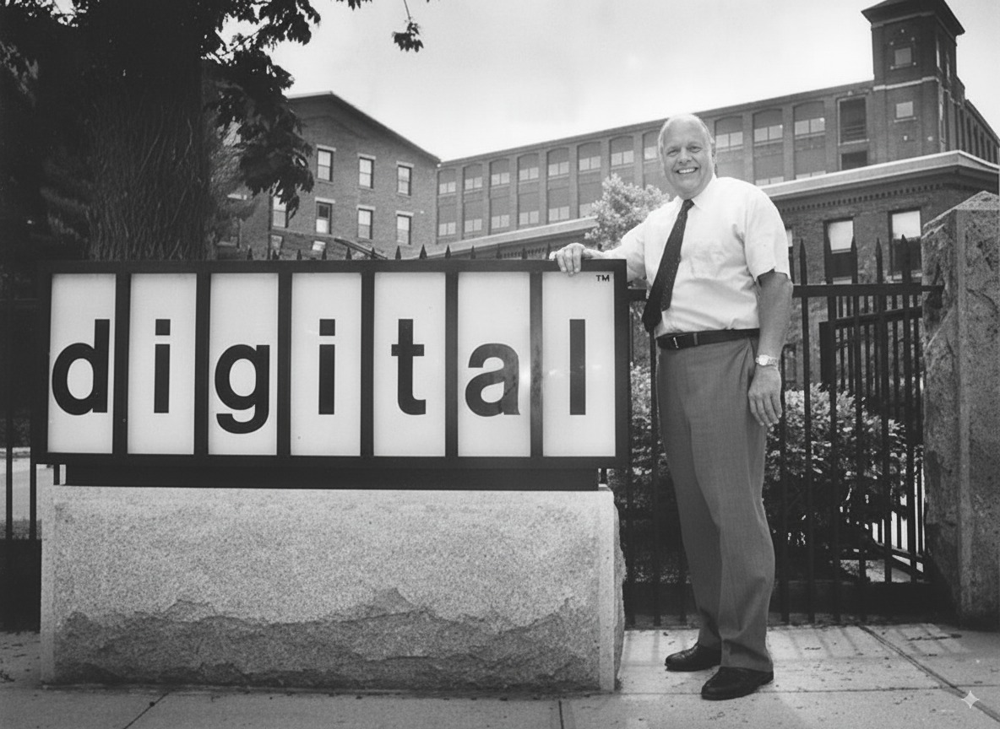
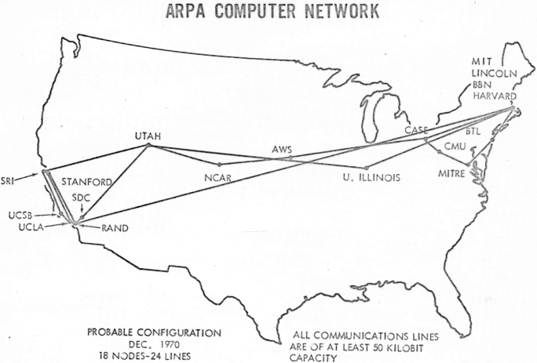
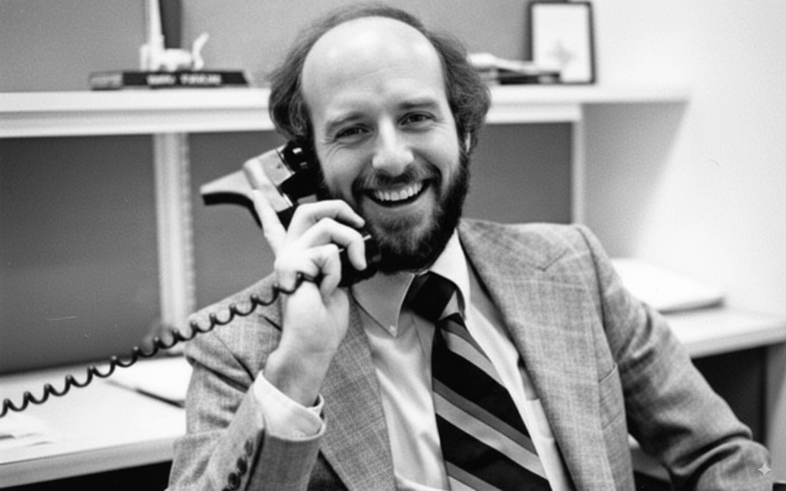

# The Day of the Blast

**How the first mass email created outbound’s original sin**

Published: September 4, 2025

**I. The Mill in Maynard**

The birthplace of spam smelled faintly of wet wool.

Digital Equipment Corporation, DEC to insiders, ran its empire from an old mill in Maynard, Massachusetts. Brick walls, long windows, the river just outside. Where spindles once clattered, engineers now argued about logic circuits.

DEC was founded in 1957 by two engineers with sharply different temperaments. Ken Olsen was brilliant, stubborn, and famously confident in his forecasts — including one pronouncement that would come back to haunt him¹. Harlan Anderson, more pragmatic, clashed with Olsen often enough that he left the company in the early 1960s. Together, they transformed a wool mill into the launchpad of the minicomputer revolution.

  
  
Ken Olsen, DEC's visionary founder, exept when it came to home computers.

Their weapon was the PDP line, which shrank the hulking IBM mainframe into something that could sit in a university lab, humming away under fluorescent lights. The PDP-8 in 1965 broke the $20,000 barrier; the PDP-11 went on to train a generation of programmers.

By the late 1970s, DEC was the world’s number two computer maker. IBM still wore the suit and tie; DEC showed up in corduroys and a coffee stain. One preached centralization. The other whispered: give the smart people their own machines and see what happens.

¹Olsen in 1977: “There is no reason for any individual to have a computer in his home.”

**II. The Next Big Thing**

But markets move. IBM wasn’t going away, Hewlett-Packard was closing in, and the personal computer loomed like a storm cloud on the horizon. DEC needed another hit.

Enter the VAX — the Virtual Address eXtension line, launched in 1977. These were muscular minicomputers, designed for real workloads.

DEC had the machine. What it needed was the stage. And in 1978, the stage was a fledgling network called ARPANET.

**III. The Network of the Chosen Few**

In 1969, the U.S. Department of Defense funded a bold experiment: connect research computers across the country so information could move even if parts of the system went down. Four machines went online first: UCLA, Stanford Research Institute, UC Santa Barbara, and the University of Utah. Resilience was the goal, survival through outages or attacks.

What began as a defense project quickly turned academic. By the early ’70s, ARPANET hosted email, file transfers, even the first awkward stabs at online chat. Membership was tightly controlled: government agencies, universities, research labs. Having an ARPANET account meant you were inside a small, privileged circle trusted by the Pentagon.

  
  
ARPANET in its formative years: a sparse, elite graph of trust.

By 1978, that circle had grown to a few hundred nodes. The users were scientists, grad students, systems managers, defense contractors... the very people who decided which machines their institutions would buy. Logging on conferred status: technically fluent, institutionally powerful, and, coincidentally, DEC’s perfect customer profile.

The network wasn’t a marketplace. It was a curated guest list. For a marketer like Gary Thuerk, it looked like destiny.

**IV. The Father of Spam**

Gary Thuerk wasn’t an engineer. He studied business at the University of Massachusetts and joined DEC through the marketing track. His job was to move machines, not design them: booking demo halls, organizing roadshows, finding the people who could sign purchase orders.

By the mid-1970s he was a young manager in DEC’s Marlboro office, ambitious and audacious. Engineers at DEC often treated marketing as ornamental, but Thuerk believed in the leverage of getting the message right. He wanted to prove that marketing could matter as much as circuitry.

By spring 1978, he spotted an opening. ARPANET wasn’t just a research tool; it was a ready-made address book of the very people who decided which minicomputers to buy. One list, hundreds of decision-makers. For Thuerk, it looked less like a network experiment and more like the most efficient invite list he’d ever seen.

**V. The Day of the Blast**

On May 3, 1978, Thuerk pulled the trigger. DEC was hosting two events in San Francisco and Los Angeles to unveil the DECSYSTEM-20, a time-sharing descendant of the PDP-10. Instead of dialing phones or licking envelopes, he drafted a single ARPANET message.

> “We invite you to a presentation of the new DECsystem-20 family of systems, the most powerful interactive minicomputers in the world…”

The invitation went out to 393 recipients. ARPANET’s mail program, never designed for mass lists, buckled under the load. Addresses spilled into the body of the message, creating a messy block of exposed hostnames; a digital equivalent of printing the guest list on the front of the envelope.

Embarrassing? Yes. Disqualifying? No. The important part had already happened: the blast had cleared the machine and landed in hundreds of inboxes.

**VI. Pandemonium**

The response was swift — and hostile. ARPANET was funded by the Department of Defense and reserved for research and collaboration. Commercial use broke a shared norm.

Administrators erupted. Memos flew. One captured the mood:

> “This was a flagrant violation of the ARPANET… advertising of particular products should be strongly discouraged.”

Thuerk’s colleagues bristled as well. In a company where engineering ruled and marketing survived on sufferance, he had committed a cultural felony.

His bosses at DEC scolded him. But they didn’t fire him.

And that detail is the key. From the very beginning, spam was condemned in public and rewarded in private. Thuerk himself later claimed the blast generated $10–14 million in sales. For a single email, that’s a staggering return. Outrage on the surface, results underneath. That dynamic has shaped the industry ever since.

**VII. The Paradox of the First Spam**

Forget the caricature of the clueless spammer. Gary Thuerk was a sharpshooter. The product was real. The audience was perfect. The event mattered. And the numbers proved it: millions in revenue flowed from that single unsolicited send.

He got the “who” and the “what” exactly right. He just got the “where” catastrophically wrong.

ARPANET was a members-only club built on trust, not a marketplace open to bids. It was a space for collaboration, and his message was a commercial intrusion. Consent wasn’t just missing; the very idea of it was alien to the network’s culture.

This is why the first spam is spam. It’s the original sin of confusing audience with permission. The content was relevant, but the context was violated.

  
  
Gary Thuerk, the father of spa... e-marketing.

**VIII. The Legacy**

History has been less kind than the balance sheet. Gary Thuerk is remembered as the “Father of Spam,” a title he resents. He prefers “the first e-marketer.” A technically accurate claim, but one that history has emphatically ignored.

DEC’s path adds its own irony. The company dominated the 1980s, then missed the personal computer wave. By the late 1990s, Compaq absorbed DEC, and HP later absorbed Compaq. The old mill in Maynard outlived the empire it once housed.

Thuerk himself went on to work in marketing and consulting, giving occasional interviews about “the first spam.” He never stopped insisting that the campaign was smart, targeted, and effective. But he also never escaped the label that history pinned on him.

**IX. Clean Outbound, Dirty Beginnings**

Spam began in sophistication: a clever reading of a new medium. A marketer saw a dense cluster of high-value prospects and reached for the newest channel. Commercially, it worked. Culturally, it backfired.

The tension persists. We call the alternative Clean Outbound: earn attention, don’t assume it. You can nail targeting, timing, even relevance, and still land as noise.

Thuerk’s bosses scolded him, then let the results speak louder. That was the lesson the industry absorbed: when the payoff is big enough, ethics and brand reputation are negotiable. Incentives, not norms, set the direction. And they still do.

That contradiction—condemned and rewarded—is outbound’s original sin. It began in a Massachusetts mill, with a marketer who thought like an engineer, an invitation that seemed harmless, and an inbox that suddenly didn’t feel so clean.
