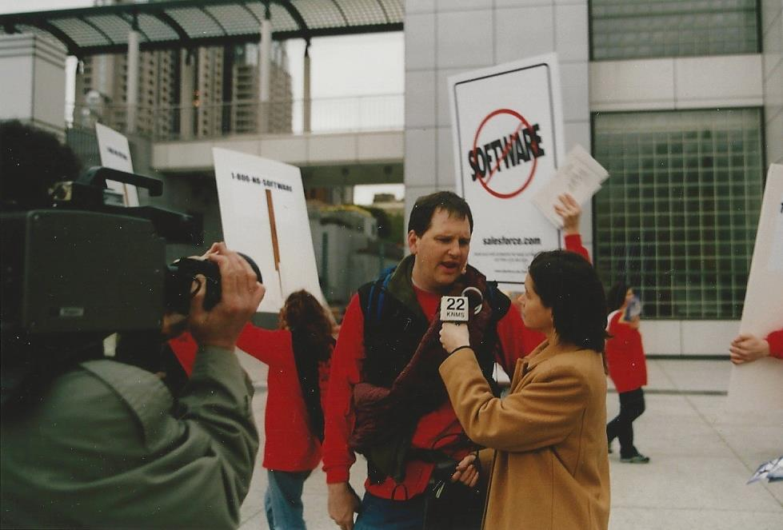

# The Gospel of Growth

**How Predictable Revenue industrialized Sales, and flooded the market with noise**

<!--
Published: September 11, 2025
-->

From lone-wolf sellers to assembly lines, Aaron Ross’s playbook rewired Silicon Valley’s 
growth engines. But the gospel that promised predictability never prepared us for what 
happened when the market stopped caring about what the factory produced.

**I. The World Before the Cloud**

Before Salesforce, enterprise software was a kingdom ruled by entrenched behemoths like 
Oracle and Siebel. Oracle alone pulled in more than $10 billion in annual revenue and 
employed over 40,000 people by 2000. Siebel, the CRM king of its era, boasted 8,000 
employees and nearly $2 billion in revenue. It was a world of on-premise software, delivered 
on CDs and installed on hulking racks of servers that lived in freezing corporate basements. 
The price tags were astronomical, often running into the millions, and that was just the 
beginning. 

Buying a CRM from Siebel wasn't like buying a product; it was like commissioning a 
cathedral. The process took months, sometimes years. And once the deal was finally signed, 
the real pain began. An army of consultants would descend upon your company for the 
better part of a year, billing by the hour to customize and implement the behemoth. A year 
later, when an upgrade was released, you’d often have to repeat the entire agonizing 
process. 

This was the world Marc Benioff, a former Oracle executive with a showman’s flair, decided 
to burn down. His new model, “Software as a Service,” was a direct assault on the old order. 

At Salesforce’s 2000 launch, Benioff wrapped the idea in spectacle. The company staged its 
“End of Software” campaign with hired actors protesting outside Siebel’s user conference 
at Moscone Center. They waved NO SOFTWARE placards and chanted, “The Internet is 
really neat… software is obsolete!” as Benioff recalled in his book Behind the Cloud. It was 
theater meant to show SaaS as a ruthless regime change. 

Instead of million-dollar upfront fees, it offered a flexible per-seat subscription. Instead of 
year-long implementations, you could be up and running in a week. Upgrades, once a 
dreaded ritual, now happened automatically, in the background, for free. By the mid-2000s, 
Salesforce had redefined how software was built, sold, and used. 

<!--

  
  
Salesforce actors, delivering SaaS with maximum cringe.

-->

But this new model ran headfirst into a very old problem. The prevailing wisdom for how to 
actually sell the stuff was a relic from the age of Siebel. 

**II. The Age of the Artist**

Before the machine, there was the artist. 

He was a rare operator, the top enterprise seller of the pre-SaaS era. We’ll call him The 
Natural. You know the type, even if you’ve only seen him in movies, or Netflix. The 
charismatic lone wolf who operates on instinct and relationships. His tradecraft lived in a 
black box: intuition, long lunches, steak dinners. His forecast was a gut feeling. His CRM 
was a leather-bound notebook filled with inscrutable scribbles about a client’s daughter’s 
graduation. He was magic. He was art. 

The Natural was perfectly adapted to the world of multi-million-dollar, on-premise deals. 
Those deals were marathons: long sales cycles, CIO politics, and relationships cultivated 
over years. SaaS as a business model broke that pattern. Contracts were smaller, renewals 
more frequent, and growth depended less on a few heroic closers than on a system that 
could generate wins week after week. The Natural’s style simply didn’t scale to that world. 

<!--

  
  
“Guess what Salesforce’s recruiter said?”

-->

**III. The Systems Thinker**

Aaron Ross stepped on the stage in 2002. Trained as an engineer, he had passed through 
venture capital, then burned through his own startup as CEO. He wasn’t a natural seller. But 
at Salesforce in 2002, he arrived with his own ideas for how to turn prospecting into a 
process. 

The need was urgent. Salesforce’s sales team was drowning in leads, but not in a good way. 
Account Executives were doing everything at once: cold outreach, qualification, demos, and 
closing. That worked at a tiny scale, but it broke under the sheer volume of leads Salesforce 
was starting to generate. In 2002, the year Ross joined, Salesforce booked $22 million in 
revenue, up from just $5 million the year before, and the pace was only accelerating. Too 
much time vanished chasing unqualified prospects. Deals stalled, pipeline felt unpredictable, 
and growth risked bottlenecking on the bandwidth of a few overstretched AEs. 

What Ross built would later be mythologized as Cold Calling 2.0: an outbound system that 
split the sales force into hunters and closers, mechanized pipeline generation, and treated 
sales less as art and more as industrial process. A new role, the Sales Development Rep 
(SDR), was responsible for one thing only: prospecting and qualifying leads. The qualified 
leads went to Account Executives (AEs), the closers who could now focus exclusively on 
winning deals. It was a factory line applied to the sales pipeline. 

The results were undeniable. Within a few years, Ross’s playbook added an extra $100 
million in Annual Run Rate. But the real explosion came later, when he left Salesforce, 
distilled his learnings into a self-published book in 2011, and gave it a name destined to 
become startup scripture: Predictable Revenue. 

**IV. The Gospel Spreads**

The book landed at exactly the right moment. The SaaS boom was in full swing, and 
investors were suddenly obsessed with building repeatable, scalable revenue machines. 
Almost overnight, Predictable Revenue became canon. 

Its magic trick was turning the abstract art of sales into a concrete, measurable 
waterfall—the sales funnel. You could now say, with data to back it up: “For every 100 
prospects our SDRs contact, we get 3 meetings. For every 3 meetings our AEs take, we 
close 1 deal.” Growth was no longer a mystery. It made growth legible. 

Founders bought boxes of the book for their sales teams. VCs handed it to their portfolio 
CEOs as required reading. Jason Lemkin called it the “Sales Bible of Silicon Valley.” The 
adoption was staggering. According to surveys by firms like The Bridge Group, by 2015 
nearly 70% of high-growth tech companies had adopted the specialized SDR/AE model. 
Copying the model felt like de-risking. This new assembly-line approach was becoming the 
industry standard. 

**V. The Prophet's Regret**

But like any gospel, its truth was bent in the retelling. What Ross had pioneered as a smart, 
surgical outbound motion began to morph into the flood of cold outreach that would drown 
buyers’ inboxes. The average B2B decision-maker, who received perhaps a handful of 
prospecting emails a week in the early 2000s, now faces a daily barrage. Recent studies 
show reply rates for cold outreach in B2B have slipped into the 1-2% range. If you’ve ever 
groaned at yet another bland, semi-personalized outbound message, you’ve lived inside 
Ross’s unintended legacy. 

Ross himself became a kind of reluctant prophet. His follow-up book, 2016’s From 
Impossible to Inevitable, can be read as one giant correction to the sins being committed in 
his name. The industry had become obsessed with the tactics in his first book while 
completely ignoring the foundational strategy. The new book was a massive 
course-correction. Its central theme was “Nail a Niche,” a plea to focus on a tiny market. It 
was a clear warning that said, “You are all doing it wrong.” 

It’s striking to revisit the way Predictable Revenue was originally pitched. The back cover 
promised “zero cold calls,” described lead generation through “marketing by teaching,” and 
called it “a new kind of sales system.” Ross’s intent was never to flood inboxes with 
automation. The gospel was framed as clean, disciplined, even educational. 

But the market heard something different. “Predictable” became shorthand for volume math, 
not strategy. The tactics scaled. The intent was forgotten.  

**VI. The Legacy of the Machine**

Predictable Revenue didn’t just shape how companies built go-to-market engines, it also 
rewired venture capital’s pattern recognition. For years, partner memos and boardroom 
questions centered less on “Is your product great?” and more on “Have you built the 
machine?” The presence of a functioning predictable revenue engine became the litmus test 
for a Series A investment—a signal that the company was ready to receive capital and pour 
it into the top of the funnel. 

In retrospect, Predictable Revenue belongs to the canon of startup scripture alongside The 
Lean Startup and Crossing the Chasm. It offered what founders and VCs crave most: a story 
of control over chaos. In a world where revenue had always felt like a black box, Ross 
promised a factory blueprint. 

Two decades later, SaaS founders still talk about “building a predictable revenue engine.” 
The book became bigger than its author, and the framework became bigger than the 
company it was born in. Salesforce got its $100M boost. Ross got his legacy. And VCs got a 
playbook they could bet billions on. 

The gospel gave sales its factory. But the very efficiency of that model produced buyer fatigue, channel saturation, and a creeping distrust of outreach itself. The age of predictable volume is over. The next one will have to be built on something else entirely.

The blueprint of scale taught us how to grow, not what to do when the market stopped caring about what the machine produced.
