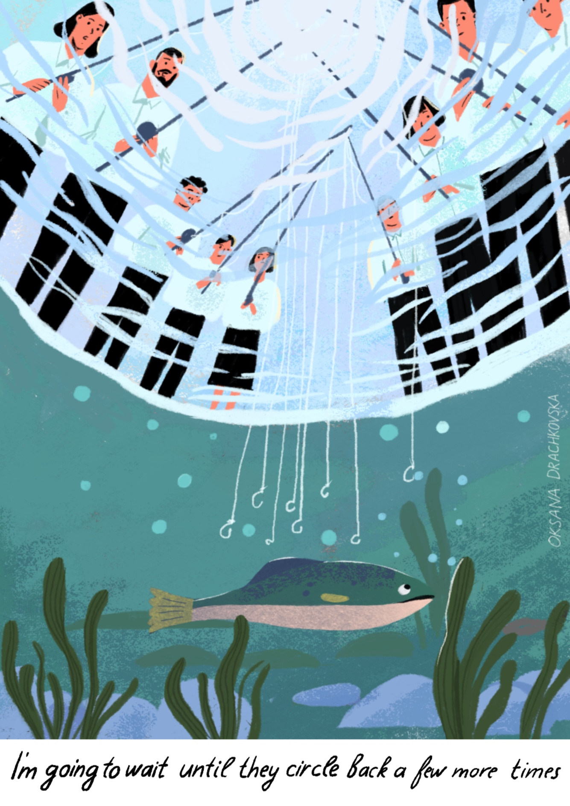

# The Irreducible Minimum

*One of the best-kept secrets in the start-up world is that you can access almost anyone you want to with a great cold email.*
— Auren Hoffman¹

*If someone didn't ask for your email, and you're trying to sell them something, it's spam. End of debate.*
— Jarland Donnell²

*Email is the last great unowned technology.*
— Jonathan Zittrain³

---

Place two skulls on a table. One belongs to a thylacine, the Tasmanian wolf, closer to a kangaroo than to anything with a placenta. The other belongs to a dog. They are separated by 160 million years of evolution. Pick them up. Turn them in your hands. The teeth are the same. The zygomatic arches, the braincase, the proportions of the snout, all the same. Even a trained zoologist might hesitate to distinguish them. The only reliable tell is two small holes in the palate (the palatal vacuities) found only in the marsupial. The zoologist would have to turn the skull over and look inside the mouth to find the difference. From the outside, the niche has made them identical.⁴

This book argues that the same thing has happened to your inbox.⁵ Two populations of senders — spammers and sales teams — sharing no intent, no lineage, and no moral universe, have converged on the same playbooks. One didn't copy the other, but the selection pressures of the inbox admitted few workable solutions. Unless you understand why that convergence was inevitable, few things about the current trajectory of the channel make sense.

---

For about twenty years, cold email was one of the greatest equalizers of commerce, the only channel that let you reach any specific person on earth for free. Brian Chesky and Joe Gebbia cold emailed their way to Airbnb's first hosts and guests before the platform had any reason to be trusted. Aaron Levie was a college student running Box out of his dorm when he cold emailed Mark Cuban, who replied within minutes and wrote Levie a $350,000 check.⁷ The lore is full of these stories because the channel kept making them possible: improbable connections, at zero cost, with huge upside.

Not long ago, someone on LinkedIn described, in detail, the exact problem my startup had built a product to solve. They ended the post with "if anyone knows a tool that does this, let me know." I did all the research. Their profile, their company, the specific pain they'd described. Perfect ICP match.⁶ I wrote one email. A direct answer to a direct question from someone who had publicly asked for it. I hit send.

Nothing came back.

If you work in sales, this will sound familiar. If you don't, what you need to know is that open and reply rates have been in decline for years.¹⁵ The common explanation is that there's too much email now. This is true but insufficient. The deeper story is that cheap, permissionless access to other people's attention was never the natural state of things. It was a historical anomaly: a twenty-five-year window that opened because of specific technical and economic conditions.

Sahil Lavingia built Gumroad, a platform for independent creators, with no sales team and no venture treadmill, then wrote *The Minimalist Entrepreneur*.⁸ The book's entire philosophy is to strip a company to the essential, remove everything that can be removed, and only keep what remains. His advice to founders trying to find their first customers: cold outreach. It's awkward. It's uncomfortable. Most people will ignore you. "Trust me, if there was a better way, people would have found it." The person whose entire framework is about eliminating the unnecessary could not eliminate this. Cold outreach was the irreducible minimum. The thing left over after everything else had been stripped away.

And he's right. Sales is essential and fundamentally good. At its core, it accelerates value reaching the people who need it, shortening the gap between what a product promises and what a customer actually experiences. Cold outreach is how that often starts. It is the road-tested, proven fallback. The method you could always rely on when every other channel wasn't available to you. 

---

My investors are probably wondering how I ended up writing a book about email when, maybe, I should have been sending it. If any of them are reading this: DM me, I'll give it to you neat.

Stripe, founded by two brothers who grew up in rural Ireland, is known for building the payments infrastructure behind most of the internet. I was an early Revenue Operations hire there. Stripe is also perhaps the best-known example of a company that grew without sales. Engineers integrated the product, loved it, and talked about it to other engineers, who did the same. But the company would eventually move upmarket, with more complex buying processes, and for that it needed a real sales organization.

Senior operators and AEs were brought in. The motion worked, inbound was strong, and AEs converted. And then, on top of an already-working sales function, Stripe decided to build a dedicated outbound layer. The AEs were too expensive to do their own prospecting, so the company created a separate lead gen function: the OBAs, Online Business Associates, not SDRs, because the connotations of outbound felt uncomfortable in a culture that had grown on the strength of its product alone. They got the best tools, the purest, hyper-targeted prospect lists, assembled by data scientists who had previously been hunting for subatomic particles. I am not making that up.⁹ And the copy to match such perfection: cutting-edge mail merge techniques that made each message feel specific, differentiated, and on-brand.¹⁰ The opposite of salesy. Stripe was going to do outbound the way Stripe did everything else — better than anyone had done it before.

And I remember thinking something I never said out loud: *why?* Sales was already running. The brand was pulling inbound. We had multiple growth levers other than outbound we weren't really pulling. We hadn't even properly started cross-selling. And yet, we were building outbound. It was a passing thought, and I filed it away.¹¹

It came back years later, when I was a startup founder in Barcelona. No brand or built-in virality. No content engine. A great product, but just a year of runway left. The people around us — investors, advisors, everyone — told us to build "the machine." I had spent years building revenue infrastructure at three different hyper-growth tech giants. I had high fluency in sales systems, CRMs, pipeline architecture. But I did not have the first clue how to start an outbound operation from scratch.

So I googled it. The RevOps guy from Stripe, sitting in a co-working space, reading beginner's guides to email sending infrastructure. And what I found was an entire industry I was only vaguely aware existed. I didn't know that sending a batch of emails from a new domain would destroy its reputation overnight. I didn't know that domain reputation was a thing you had to build.¹² And a revelation that stopped me cold: there are tools — entire businesses — whose sole purpose is to manufacture that reputation before a single real person receives a single real email. Machines talking to machines, generating synthetic opens and replies, building a score that will convince Gmail's algorithms you're a real person having real conversations. You do this for weeks. No human is contacted. No human is involved. It is a mating display performed for an audience of spam filters.

Then there was the copy. We'd been given a starter kit of sequences, templates to get us off the ground. They were running for a few days when replies started coming in. People apologizing for the delay in getting back to me. I was confused. I hadn't written to them. Then I looked at the templates and saw the subject lines: "Re: our conversation." A reply to a conversation that had never taken place. The templates had worked though. A few people thought they'd left me hanging, and they felt bad about it.

There is an episode of Seinfeld where George Costanza decides to do the opposite of every instinct he has — he tells a beautiful woman he's unemployed and lives with his parents, he yells at his boss in a job interview — and it all works.¹³ He gets the girl, he gets the job, and he is miserable, because the person who succeeds isn't him. That's the feeling. I quietly removed those templates and didn't tell anyone. Then I followed up with every person who'd replied because I needed them. I erased the ruse but kept the leads.

---

A chemical plant discharges waste into the river; the cost is borne by communities downstream. A nightclub generates profit for its owners while neighbors lie awake at 3 AM. Industrialized outbound sales works in an uncomfortably similar way. The sender only pays for the sending infrastructure. The VP of Sales, whose coffee break just got swallowed by her inbox, covers the rest of the bill. Economists call this a negative externality: a cost imposed on third parties who neither chose nor benefit from the transaction. VC-backed founders are a common target of outbound campaigns — I was launching sequences in one tab and deleting them in the other, feeling the cost I was imposing as it was being imposed on me.

That dissonance is why this book exists. The feeling of being a person who is not a spammer, doing the things a spammer does, using the tools a spammer uses, and having no way to prove the difference. Two skulls on the table. I'm inside one — which one?

---

It doesn't have to be this way.¹⁸ Does it?

It does. Send fewer, better emails. Research the person. Write something specific. Surely quality would compensate for quantity. But the math is unforgiving: if you halve your volume, you need to double your conversion rate to hold output constant. In 2024, with reply rates already in freefall, that felt less like a strategy and more like a prayer.

A signal is honest only when it's costly enough that a faker can't afford to produce it. The Israeli ornithologist Amotz Zahavi understood this watching birds in the Negev Desert.¹⁴ The peacock's tail proves fitness precisely because it's a burden. Cold email had its own version of this for twenty years: the homework. You spend thirty minutes researching someone, you write something specific, and the recipient can tell you've spent time on the message. "I noticed your Series B" worked in 2016 because it meant a human being had spent real minutes on your LinkedIn profile. Now an AI produces it in two seconds. And when the honest signal becomes free to fake, the recipient can no longer distinguish genuine interest from manufactured intent.

Maybe I was doing it wrong. Probably I was doing it wrong. Was our targeting off, our product positioning unclear, our timing bad? Probably all three, at different points — like any early-stage startup. But the channel-level data was telling me the same story my inbox told. Open rates falling. Reply rates halved. SDR headcount cut by a third across the industry. The good SDR whose sequences used to get replies when no one else's did? Her opens are in single digits now too.

<!-- IMAGE: Fish waiting for hooks -->

  

An anecdote isn't an autopsy. My failure to get that reply from the LinkedIn guy didn't prove the channel was dying, but it gave me a question that evidence later answered.¹⁶

My new startup¹⁷ also had no brand, so I started writing. The saturated inbox seemed like the right subject. I lived inside the problem (still do), and I suspected my audience did too. I had no idea where it would take me, no roadmap other than making something worth reading and, hopefully, sharing. By the sixth essay I had stopped writing content marketing and realized I was writing a book. Every thread I pulled led somewhere I didn't expect, and they all converged on the same thing: a shared resource, free to use and expensive to protect, consumed by everyone acting in their own interest. The inbox is a commons. Evolutionary biology, game theory, economics, regulatory history. All had already described what was happening to it. They just hadn't been introduced to each other. And the pattern wasn't confined to email. Every open channel — the phone call, the LinkedIn message, the text, the search result — was following the same arc, at different speeds, for similar structural reasons.

The inbox is being consumed by rational actors using the best available tools for rational reasons. Every tool that makes outbound more efficient gets converted into volume. More volume degrades the signal. Which forces more volume. And now the final tool is arriving. An AI agent that can produce a perfect, personalized, individually researched email to any human on earth, at close to zero marginal cost, at infinite scale, with no human in the loop to feel the damage it produces. When the best possible email is free, the channel will collapse not from noise, but from the destruction of information itself.

Which leaves us with an unsolved dilemma.

To save the channel from noise, you gate it: verify identity, require credentials, demand a financial stake. This closes the door on the Stranger — the founder with no trademark, the person with something worth saying and no credential to prove it in advance. To save the Stranger, you keep the channel open. And the channel dies under the weight of everyone who abuses the openness.

To save the channel from noise, one must sacrifice the Stranger. To save the Stranger, one must sacrifice the channel to the noise. The historical anomaly of the open inbox might be coming to an end. What will come after?

---

<strong>What's in this book</strong>

Part I traces how the open inbox emerged, who consumed it, and why every attempt to save it never made it better for long. It moves from the first unsolicited email in 1978 through the industrialization of sales, the arms race between senders and filters, and the regulatory battles that were won and then lost. And some unexpected detours: a Fermi estimate of cold email as a negative externality, the untold psychology of selling, and a rabbit hole into the true source of buying intent signals. It concludes with the AI agent that will probably finish what volume started. Each chapter is self-contained. Read them in order or skip to whatever catches your eye.

Part II is about what comes after.

---

<strong>Footnotes</strong>

¹ Auren Hoffman is a Silicon Valley entrepreneur and investor, co-founder of LiveRamp and SafeGraph, who has backed hundreds of startups. The quote is from "How To Write a Great Cold Email That Will Actually Get a Response," published on his personal blog Summation, May 4, 2020. He is speaking from the sender's side — as someone who has used cold email to build companies and advises founders to do the same.

² Jarland Donnell is the founder of MXroute, an email hosting provider — someone whose business depends on email infrastructure functioning correctly. His post "Cold Email Is Spam, Full Stop," published November 2025, is written not by a critic from outside the industry but by someone who routes email for a living and has run out of patience for the distinction.

³ Jonathan Zittrain is a professor of law and computer science at Harvard and co-founder of the Berkman Klein Center for Internet and Society. The quote appears in "Is Email Evil?", published in <em>The Atlantic</em> on November 12, 2015. The "unowned" framing points to SMTP's original design: a protocol built for a high-trust network, with no central authority and no built-in mechanism to exclude anyone. That design decision is covered in this book.

⁴ The thylacine comparison is borrowed from Richard Dawkins and Yan Wong, <em>The Ancestor's Tale: A Pilgrimage to the Dawn of Life</em> (2004; revised edition, 2016). The anecdote appears in the Marsupials chapter. The marsupial-placental divergence is now dated to approximately 160 million years ago. See "Two Skulls" in this series for the full story and its uncomfortable implications.

⁵ If you picked up this book looking for outbound tips, this is not your book. You've probably figured that out already.

⁶ ICP: Ideal Customer Profile. The description of the company (and the person within it) most likely to buy your product. The term has become ubiquitous in B2B sales and is often attributed to Lincoln Murphy, who popularized it in the context of SaaS customer success.

⁷ Aaron Levie and Mark Cuban: Levie has recounted the story in multiple interviews. Cuban was known for replying to cold emails, a practice he has discussed publicly on several occasions.

⁸ Sahil Lavingia, <em>The Minimalist Entrepreneur: How Great Founders Do More with Less</em> (Portfolio/Penguin, 2021), Chapter 7: "Sell to Your First Hundred Customers," p. 97. Lavingia frames cold outreach not as a growth tactic but as a necessity — the only reliable way to find first customers when you have no audience, no brand, and no distribution. He is explicit that the discomfort is not a bug to be engineered away.

⁹ Jake Feintzeig. Ph.D. in Physics from the University of Wisconsin-Madison, where his doctoral research involved hunting for astrophysical neutrinos using a detector buried in a cubic kilometer of Antarctic ice. Postdoctoral fellow in nuclear and particle physics at Lawrence Berkeley National Laboratory. Then six years as a Staff Data Scientist at Stripe, where his work included building the data product that identified prospective customers. I was not making that up.

¹⁰ Dogpatch Advisors, founded by Ben Salzman and Kyle Williams, both ex-Googlers who had worked in sales. Their mail merge logic could generate copy that felt individually written at scale, four years before the launch of ChatGPT. They were later acquired by ZoomInfo.

¹¹ In conversations I had while researching this book, a former colleague offered a simple answer: "We felt that by not doing it, we were leaving money on the table." There was no evidence that Stripe was losing deals for lack of outbound. The feeling was enough. Outbound is so core to the soul of sales that not doing it felt wrong — even at a company that had built one of the most successful inbound engines in the history of SaaS.

¹² For a full explanation of how domain reputation works and why an entire industry exists to manufacture it, see "Explainer: Email Warming" in this series.

¹³ "The Opposite," <em>Seinfeld</em>, Season 5, Episode 22 (May 19, 1994). George, in despair at the diner, decides that since every instinct he has ever had has been wrong, the correct course of action is to do the opposite of whatever his gut tells him. Jerry encourages the experiment. It works spectacularly. The episode is often cited as a comedy about confidence, but it's really about the horror of succeeding as someone you don't recognize.

¹⁴ Amotz Zahavi first proposed the handicap principle in 1975: "Mate Selection — A Selection for a Handicap," <em>Journal of Theoretical Biology</em> 53 (1975), 205–214. The idea was controversial for decades — many biologists considered it logically flawed — until Alan Grafen provided a formal mathematical proof in 1990. Zahavi spent much of his career studying Arabian babblers in the Negev, where he observed that dominant birds performed costly, conspicuous behaviors precisely because the cost proved they could afford it. The parallel to cold email: "I noticed your Series B" was once a costly signal — it required real research time — and the cost was what made it honest.

¹⁵ B2B cold email open rates fell from roughly 36% to 27–28% year over year (Belkins 2025 B2B Cold Email Study; Martal Group 2025 Cold Email Statistics). Reply rates dropped from approximately 6.8% in 2023 to 5.8% in 2024. Emergence Capital's 2024 "Beyond Benchmarks" study of 560+ B2B SaaS companies found 36% decreased SDR/BDR headcount — the highest reduction rate of any sales role.

¹⁶ Richard Dawkins, <em>The God Delusion</em> (Bantam Press, 2006). The opening chapter describes Dawkins' childhood awe at the beauty of nature experienced through Anglican Christianity — an awe he later concluded was better explained by science than by theology. The structure is not "my experience proved the conclusion" but "my experience created the question that evidence then answered."

¹⁷ A different company from the one described earlier in this chapter. At the time of writing (March 2026), I'm one of the builders of Talka.ai — which faces similar challenges, and which is part of the reason this book exists.

¹⁸ Most early-stage startups face a cold start. With the exception of product-led growth, most other distribution strategies take time to build. Outbound is often the only thing that can work immediately. This book is partly written for those founders. The argument isn't that outbound is wrong. It's that the channel is degrading in ways the ecosystem hasn't fully reckoned with, and that the standard advice ("send more, optimize harder") is making it worse.

