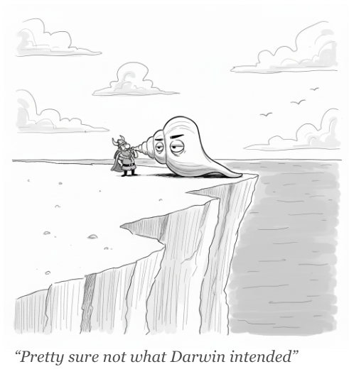
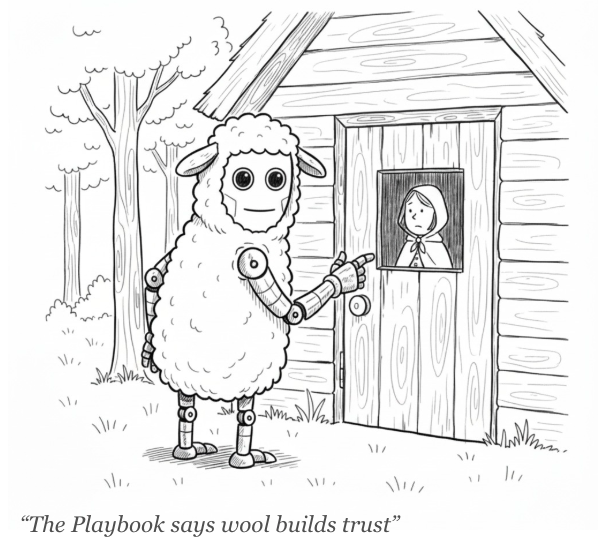

# The Red Queen

**A 40-Year History of the Spam Arms Race**

<!--
Published: September 5, 2025
-->

The moment email became a way to reach a crowd, the inbox turned into contested ground. Defenders improved their filters, attackers reworked their tactics, and the cycle repeated. After forty years of this loop, the overall state of the inbox is remarkably similar to where it began.

**I. The Cliffs**

Stand on the Dover coast on a bright day and the White Cliffs glare back, improbably stark against the sea. They’re made almost entirely of ancient plankton shells, billions upon billions of microscopic skeletons pressed into chalk over tens of millions of years.

It’s tempting to treat them as geology, nothing more. But they are also the fossilized memory of an arms race.

Two hundred and fifty million years ago, after the Permian extinction, mollusks were soft targets. Their shells were paper-thin, half a millimeter at most. Early crabs and shell-crushing fish cracked them like peanuts.

Then came escalation. By the Jurassic, shells had doubled and tripled in thickness. By the Cretaceous, they sprouted spikes and ridges. Crabs answered with claws three times stronger than their ancestors’. Fossils preserve the scars: failed bites, drill holes, fractured shells.

Predator, prey, predator, prey. Each adaptation met by an answering counter-move, a cycle that forced both sides to change or fall behind.

Layer this over millions of years and you end up with cliffs tall enough to guide ships. Evolution leaves monuments — a sedimentary ledger of pressure and response.

**II. The Red Queen**

This treadmill is what biologist Leigh Van Valen named the Red Queen effect, after Lewis Carroll’s queen who tells Alice:

> “Now, here, you see, it takes all the running you can do, to keep in the same place.”

Van Valen argued that species aren’t just adapting to their environments but to each other’s adaptations. A coevolutionary arms race. “Continuing development,” he wrote in 1973, “is needed just in order to maintain fitness relative to the systems it is co-evolving with.”

Carroll himself admired the Dover cliffs on his Channel crossings. He could never have guessed his whimsical queen would end up as one of biology’s most durable metaphors. But here we are.

  

**III. The First Bite**

Fast forward to May 3, 1978.

Gary Thuerk, a marketer at Digital Equipment Corporation, decided to announce a product demo. He did it by sending a single message to every ARPANET address he could find on the West Coast—nearly four hundred of them. The network’s mail protocol, never designed for such a blast, promptly choked. The recipient list was so long it overflowed the header and spilled down into the body of the message itself, a clumsy, unavoidable catalog of every person who had just been spammed.

In that tight-knit digital ecosystem, the message landed like a bite on unarmored flesh.

This was the opening move in a new kind of arms race. The arena had changed from the tidal pool to the inbox, but the Red Queen’s logic was identical: an escalating contest between attack and defense, fought between those seeking attention and those trying to avoid distraction.

The prey reacted quickly. ARPA administrators condemned the intrusion, angry memos flew, and rules were drafted to forbid commercial use. Outrage hardened into a cultural shell.

But the incentives pointed in a different direction: Thuerk’s bosses publicly scolded him, then, privately, kept him on. The blast was credited with more than $10 million in sales. Etiquette could be bruised; revenue could not. The arms race had its fuel. (For the full story of Thuerk’s infamous message, see [The Day of the Blast](https://cleanoutbound.com/posts/the-day-of-the-blast/).)

**IV. The Deluge**

Once the payoff was visible, escalation was inevitable. Cultural defenses were brittle; infrastructure offered leverage. The richest seam was the “open relay”: a misconfigured mail server willing to forward anything for anyone. It was as if every post office in the world agreed to deliver any sack of letters, free of charge, no questions asked. Overnight, the cost of sending collapsed toward zero and a single stunt became industrial practice.

The first filters arrived soon. They were laughably simple, scanning for banned words like “Viagra.” For a moment, it worked.

Then “Viagra” became “V1agra.” Spammers padded messages with invisible gibberish to dilute the signal and confuse the filters. Each shell provoked a sharper claw.

And then the abstract threat acquired a face. In 1994, a husband-and-wife legal team, Laurence Canter and Martha Siegel, posted ads for their immigration law services across thousands of Usenet groups. The pitch was ordinary; the method was not. By blanketing nearly every discussion board, they turned a small ad into a network-wide nuisance. The backlash was instant. Canter and Siegel became the “Green Card Lawyers,” briefly the most hated people on the internet, and for many this was the moment spam felt less like an annoyance and more like an invasive species.

<!--

  
  
Martha Siegel and Laurence Canter: "Technically, it was class action."

-->

**V. Laws and Bayes**

The ecosystem fought back on two fronts: technical and legal.

On the technical front, programmer Paul Graham published *A Plan for Spam* in 2002. Instead of crude keyword lists, he used probability. A “Bayesian filter” would look at the words in an email and estimate the odds it was junk. If a message contained “Viagra” and “free,” the math said spam. If it contained “project” and “deadline,” the math said ham. Not perfect, but clever — a truly adaptive shell.

Meanwhile, lawmakers tried to legislate the problem away. The CAN-SPAM Act of 2003 sounded decisive. It wasn’t. The law was a clumsy shell, full of holes.

Neither defense hold for long.

The counter to Bayesian filters was “random word salad.” Spammers stuffed emails with chunks of legitimate text — stolen from novels, news stories, even other emails — to push the probabilities back in their favor. Camouflage by ordinary English.

When that faltered, they tried another mutation: image-only spam. The message was no longer text at all, but a JPEG of the ad. A human eye could read it instantly. A Bayesian filter, which only looked at words, saw nothing.

**VI. Botnets and Blackouts**

By 2007, spam made up 90% of global email. Not a typo. Ninety percent.

Predator move: botnets. Millions of ordinary home computers infected with malware and quietly drafted into a zombie army. Each one looked normal on a desk, but together they became a giant spam factory. The Storm botnet alone may have controlled fifty million machines.

Prey response: defenders tried cutting predators off at the source. They built blacklists of known spam servers, unplugged shady internet providers, and coordinated international takedowns.

The most dramatic moment came in 2008, when a little-known hosting company in California, McColo, was disconnected from the internet. Security researchers had traced a huge share of global spam traffic back to servers running there. When upstream providers finally pulled the plug, worldwide spam volumes plunged 70% overnight.

For a moment it looked like victory.

But not for long. The predators rebuilt. Mikko Hyppönen of F-Secure summed it up: “Every time we kill one botnet, another takes its place. It’s like mowing the lawn.”

**VII. CAPTCHAs and Farms**

Predator move: after blacklists and ISP takedowns made it risky to run their own servers, spammers pivoted to free webmail. Hotmail, Yahoo, later Gmail — infinite, disposable sender identities for zero cost, all piggybacking on the good reputation of a mainstream provider. Spin up a thousand accounts, blast, burn them, repeat.

Prey response: throttle the factory at the door. Providers put puzzles on the signup page to block automated account creation. CAPTCHAs, those squiggly letters you had to retype, were designed to be trivial for a human eye and maddening for a script. Early bots couldn’t read warped text; the conveyor belt of throwaway accounts slowed.

Counter-move: spammers outsourced the eyesight. They tricked users into solving CAPTCHAs (“type these letters to get your free download”), then built “CAPTCHA farms” where low-wage workers solved puzzles all day, pennies per hundred. Human perception, industrialized.

**VIII. Filters and Sequencers**

By the 2010s, brute-force volume stopped working. Google boasted its filters caught 99.9% of spam, and for once the claim was close to true. Behind the scenes, billions of signals fed machine-learning systems: sender reputation, domain age, user behavior, even the subtle rhythm of how emails were written and opened. The old flood tactics drowned under the weight of statistical scrutiny.

Predators adapted again. They turned to *email warming*: sending low volumes of harmless messages from a fresh domain to trick filters into assigning a good reputation, then slowly ramping up volume until the account was “trusted.” Sequencing tools added another layer, staggering sends and varying wording so that no two recipients saw the same pattern.

The effect was to look less like a botnet and more like a salesperson, while still being a botnet at scale. The camouflage worked because it hijacked human instincts. A message that appears timely, personal, and written “just for you” taps the same reflexes we explored in [Parasitic Sales](https://cleanoutbound.com/posts/parasitic-sales/): our tendency to trust the polite knock, to grant attention when approached as individuals. Automation had learned to mimic courtesy.

<!--

  

-->

**IX. AI vs. AI**

The arms race has now reached language itself. Large models can generate endless variations of “personal” outreach; fluent, polished, and tuned to mimic the quirks of human senders. Every email feels one-off, even when it is one of thousands.

Defenders answer in kind. Spam filters are themselves powered by models, scanning for patterns invisible to the human eye: statistical oddities in tone, rhythm, or metadata that betray automation hiding behind a friendly greeting.

For the first time, the duel is not just automation dressed as humanity, but two intelligences locked against each other; one creating the illusion of human attention, the other trying to pierce it.

This strange predator–prey dance around language is only beginning. It deserves its own story, and I will tell it soon.

**X. The Hidden Cliffs**

The history of spam is written in residues. Each message stirs a machine to act, each delivery consumes a thread of bandwidth, each deletion takes a fraction of attention. Insignificant on its own, almost invisible.

But what is negligible in isolation becomes immense in the mass. Billions of cycles of wasted computation, terabytes of empty traffic sent beneath the seas, uncounted hours of human focus pulled aside.

These layers accumulate as surely as shells pressed into chalk. An unseen sediment of inefficiency builds year after year, a cliff face invisible to the eye yet growing all the same.

All that running, only to build a monument to standing still.
